# Week1 — EGFR

Independent scientific project `EGFR` for Adaptyv Challenge 01. Prepare inputs
and analyze results on the Mac; run requested GPU work through Slurm on Mimas.
This is the primary source repository. Its historical predecessor is retained
as a read-only GitHub archive; historical scientific files are organized by campaign locally.

## Publication

Benavides, Tiburon L.; Shurina, Ben; and Montelione, Gaetano T. (2026).
*Computational design and candidate prioritization of putatively pH-sensitive EGFR binders.*
Manuscript version: 7 October 2026.

- [Main text (PDF)](2026-10-06_egfr-ph-sensitive-binder-methods.pdf)
- [Supplementary Materials (PDF)](2026-10-06_egfr-ph-sensitive-binder-supplement.pdf)

## Current top 20 from the 394-candidate assessment

The completed assessment contains **394 exact binder sequences**. The recovered selection rule admits **103 candidates** with four unforced receptor pKas and positive nominal Potts differences in both species. The five strict pKa-window matches come first; the remaining eligible candidates are ordered by maximum then summed pKa-window distance, followed by balanced confidence/affinity quality. The panel below contains **five strict and fifteen near-window candidates**. Eighteen retain the Potts direction under all tested binder-center pKa shifts.

This is the **updated retrospective panel**. The competition submission used the earlier available data. This ordering preserves the original eligibility rule and does not replace the submitted file. The earlier frozen 19+required-D46 panel remains intact; seventeen of its sequences recur here. The 291 excluded candidates retain blank ranks in the complete assessment.

[Main text: ranking documentation](2026-10-06_egfr-ph-sensitive-binder-methods.pdf) · [Supplementary Table S15: all 394 assessments](2026-10-06_egfr-ph-sensitive-binder-supplement.pdf)

Each row pairs the **human** and **mouse** EGFR D3 complexes. Species cells show ipSAE, predicted DeltaForge Kd (nM), and unforced EGFR **His37/His100 pKas**; these are receptor sites, not binder residues. Images use the established species-matched views and a common scale. Human EGFR is light orange, mouse EGFR blue, binder cyan and the D46 fusion extension magenta. The main text documents the ranking, and Supplementary Table S15 lists all 394 assessments. These predictions do not establish measured pH selectivity.

| Rank | Design and evidence | Human EGFR D3 | Mouse EGFR D3 |
| ---: | --- | --- | --- |
| 01 | [F747/m4](candidates/2026-10-07_current-top20_001/models/01_Human_EGFR_Human_EGFR_747_model_4/Human.png)<br>Strict<br>Stable at all shifts | <a href="candidates/2026-10-07_current-top20_001/models/01_Human_EGFR_Human_EGFR_747_model_4/Human.png">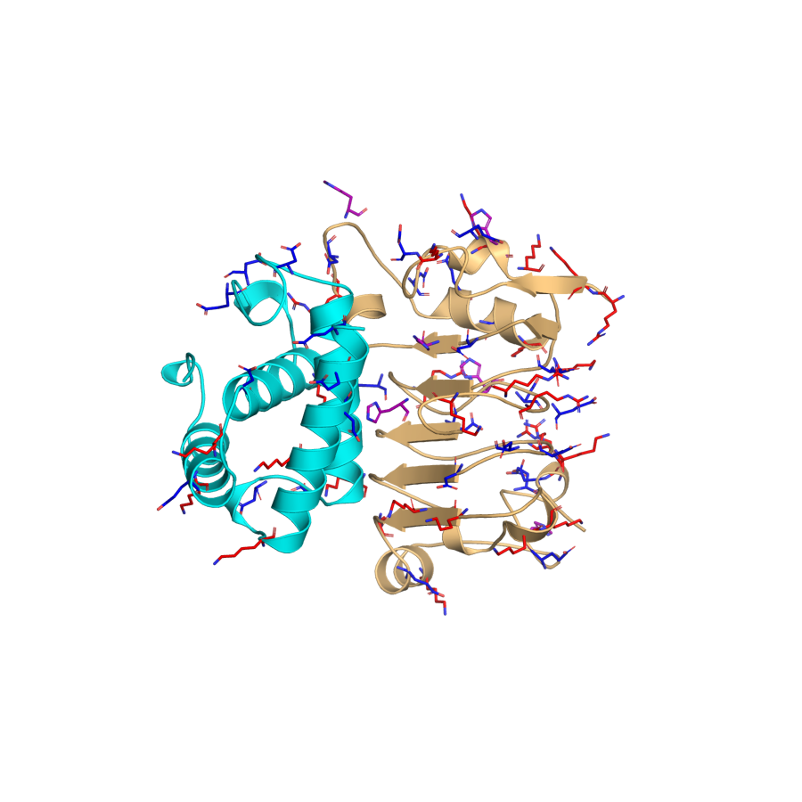</a><br>ipSAE **0.858** · Kd **49.7 nM**<br>H37/H100 pKa **6.905 / 7.107** | <a href="candidates/2026-10-07_current-top20_001/models/01_Human_EGFR_Human_EGFR_747_model_4/Mouse.png">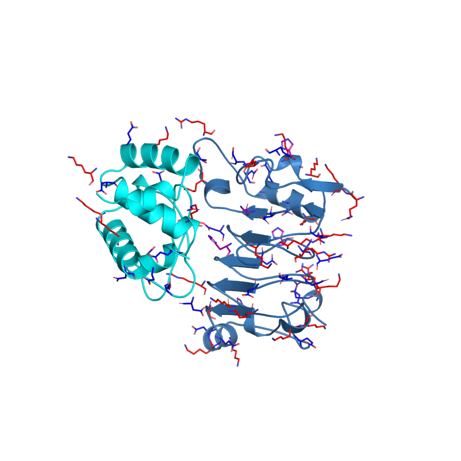</a><br>ipSAE **0.799** · Kd **60.2 nM**<br>H37/H100 pKa **7.178 / 6.980** |
| 02 | [LF-559](candidates/2026-10-07_current-top20_001/models/02_Ligand_AI_b6a74871_Design_559/Human.png)<br>Strict<br>Not stable at all shifts | <a href="candidates/2026-10-07_current-top20_001/models/02_Ligand_AI_b6a74871_Design_559/Human.png">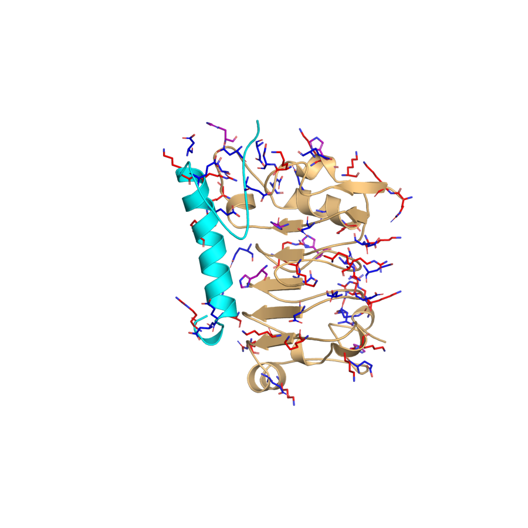</a><br>ipSAE **0.927** · Kd **64.7 nM**<br>H37/H100 pKa **6.855 / 6.694** | <a href="candidates/2026-10-07_current-top20_001/models/02_Ligand_AI_b6a74871_Design_559/Mouse.png">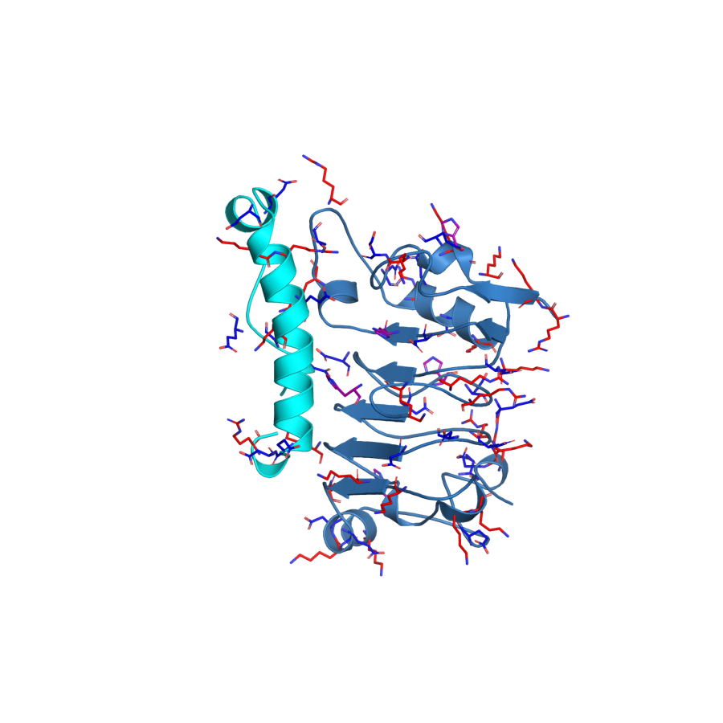</a><br>ipSAE **0.735** · Kd **74.8 nM**<br>H37/H100 pKa **7.351 / 6.537** |
| 03 | [F428/m1](candidates/2026-10-07_current-top20_001/models/03_Human_EGFR_Human_EGFR_428_model_1/Human.png)<br>Strict<br>Stable at all shifts | <a href="candidates/2026-10-07_current-top20_001/models/03_Human_EGFR_Human_EGFR_428_model_1/Human.png">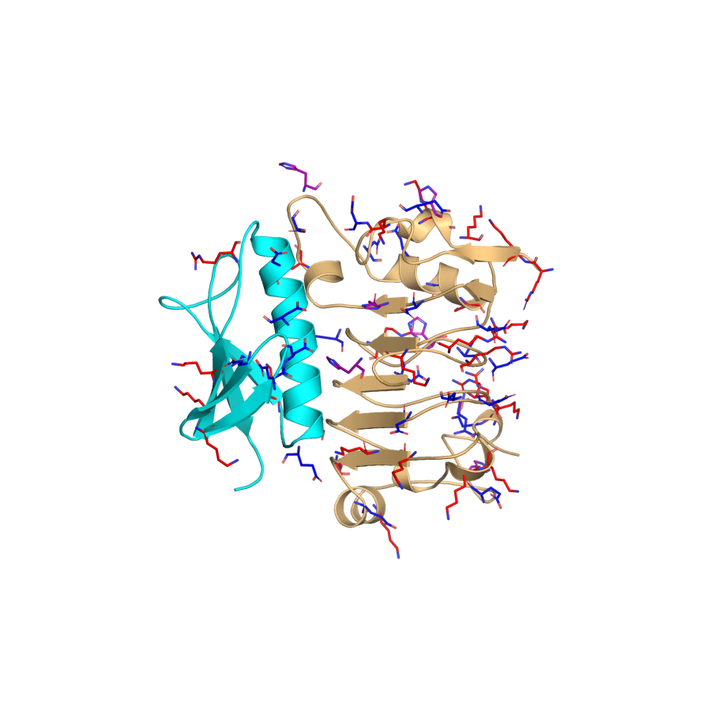</a><br>ipSAE **0.766** · Kd **114 nM**<br>H37/H100 pKa **7.181 / 6.666** | <a href="candidates/2026-10-07_current-top20_001/models/03_Human_EGFR_Human_EGFR_428_model_1/Mouse.png">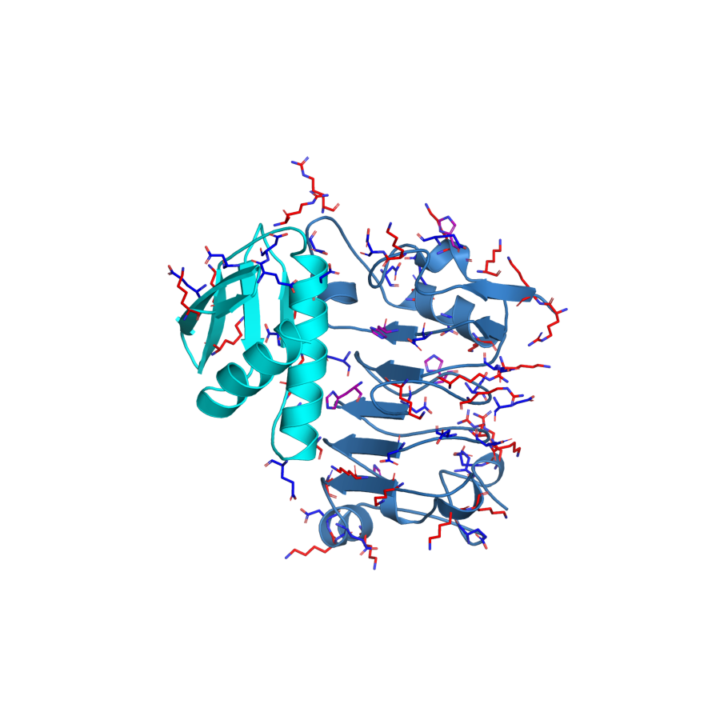</a><br>ipSAE **0.907** · Kd **33.2 nM**<br>H37/H100 pKa **6.645 / 7.231** |
| 04 | [D46-V8S](candidates/2026-10-07_current-top20_001/models/04_D46_130_V8S/Human.png)<br>Strict<br>Stable at all shifts | <a href="candidates/2026-10-07_current-top20_001/models/04_D46_130_V8S/Human.png">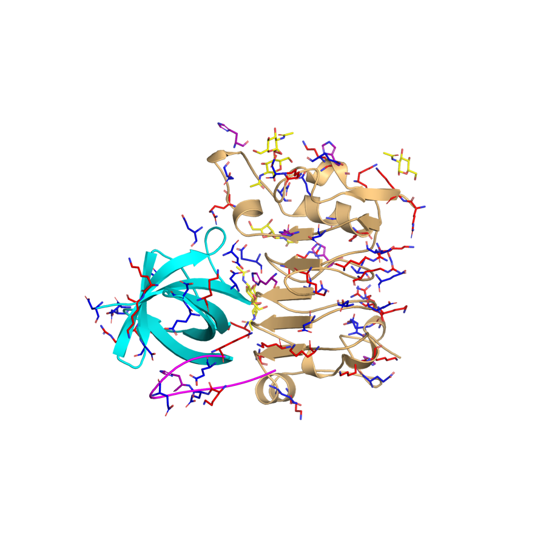</a><br>ipSAE **0.493** · Kd **150 nM**<br>H37/H100 pKa **6.918 / 7.316** | <a href="candidates/2026-10-07_current-top20_001/models/04_D46_130_V8S/Mouse.png">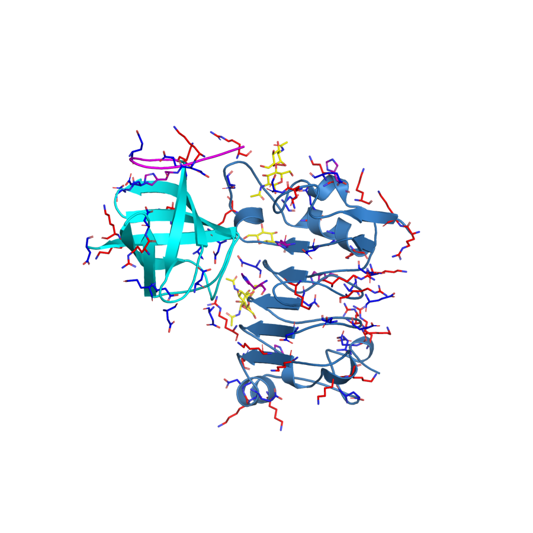</a><br>ipSAE **0.811** · Kd **201 nM**<br>H37/H100 pKa **7.048 / 6.959** |
| 05 | [F126/m4](candidates/2026-10-07_current-top20_001/models/05_Human_EGFR_Human_EGFR_126_model_4/Human.png)<br>Strict<br>Not stable at all shifts | <a href="candidates/2026-10-07_current-top20_001/models/05_Human_EGFR_Human_EGFR_126_model_4/Human.png">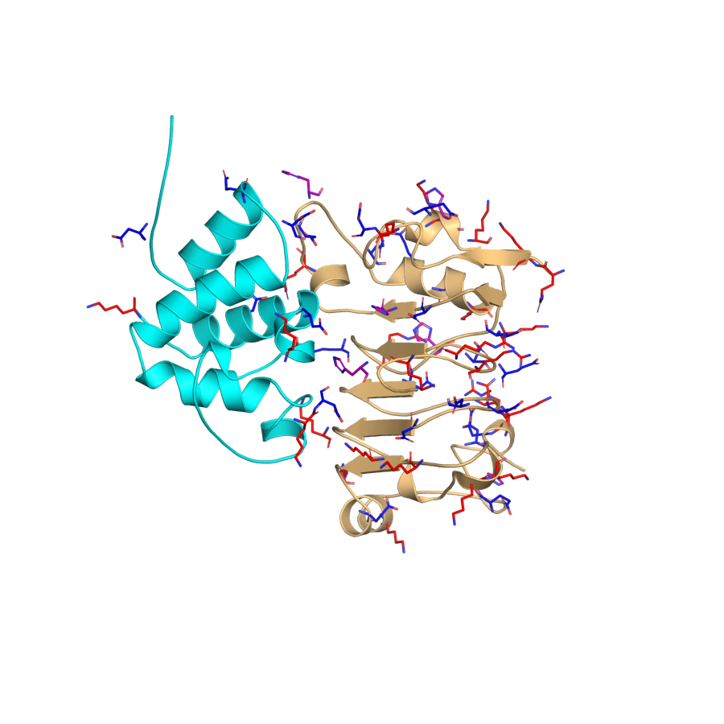</a><br>ipSAE **0.742** · Kd **876 nM**<br>H37/H100 pKa **7.200 / 7.001** | <a href="candidates/2026-10-07_current-top20_001/models/05_Human_EGFR_Human_EGFR_126_model_4/Mouse.png">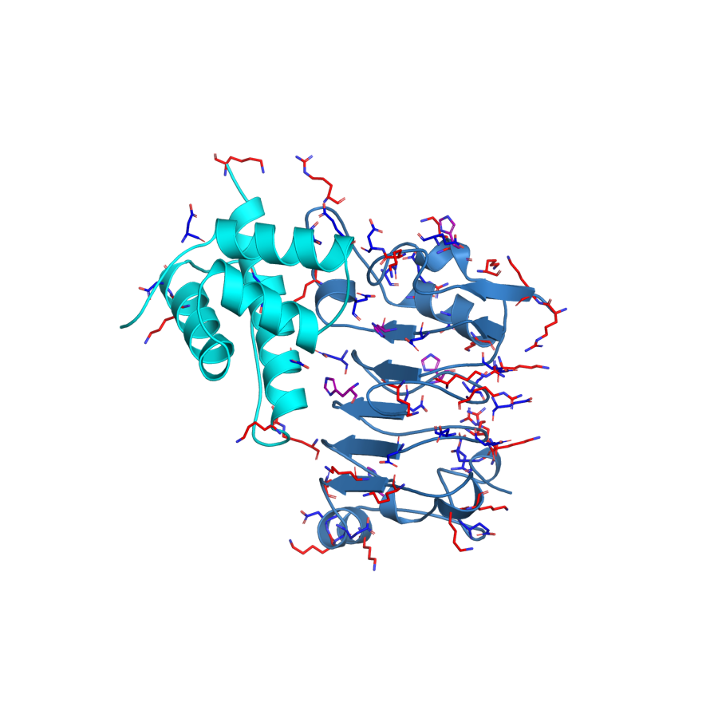</a><br>ipSAE **0.902** · Kd **44.2 nM**<br>H37/H100 pKa **7.110 / 6.678** |
| 06 | [LF-559/0061](candidates/2026-10-07_current-top20_001/models/06_LigandAI_559_phswitch_0061/Human.png)<br>Near-window<br>Stable at all shifts | <a href="candidates/2026-10-07_current-top20_001/models/06_LigandAI_559_phswitch_0061/Human.png">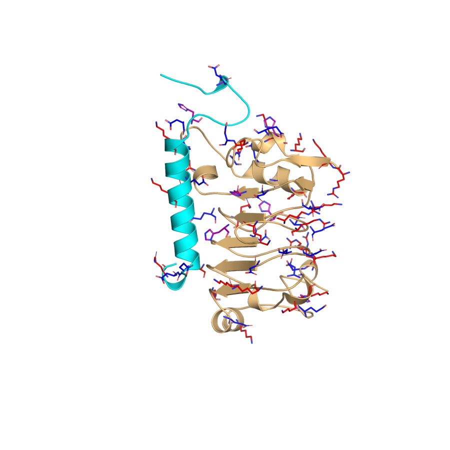</a><br>ipSAE **0.899** · Kd **236 nM**<br>H37/H100 pKa **6.777 / 6.615** | <a href="candidates/2026-10-07_current-top20_001/models/06_LigandAI_559_phswitch_0061/Mouse.png">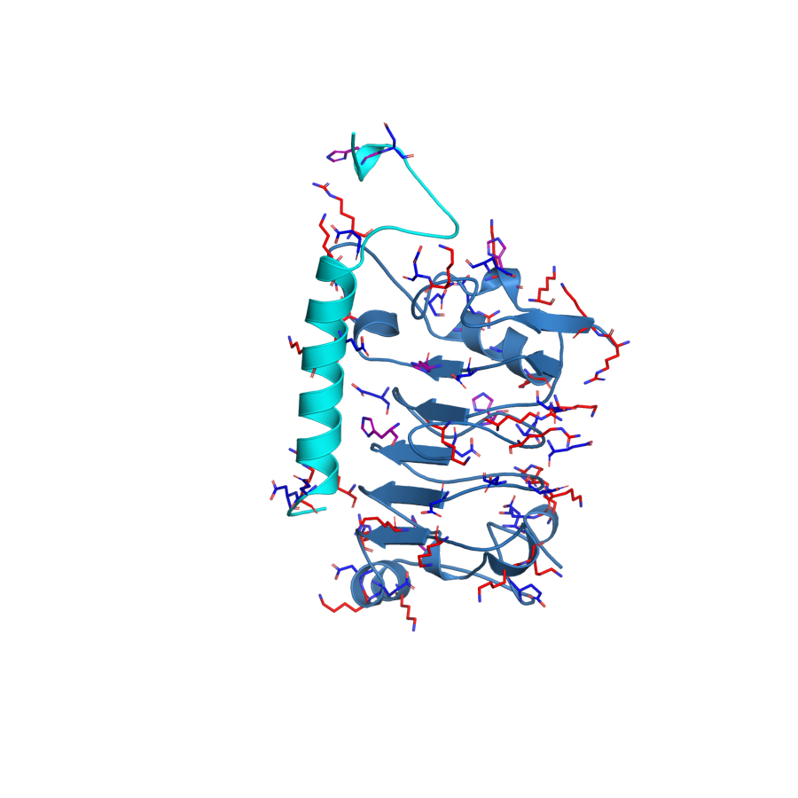</a><br>ipSAE **0.944** · Kd **64.6 nM**<br>H37/H100 pKa **6.985 / 6.485** |
| 07 | [F157/m5](candidates/2026-10-07_current-top20_001/models/07_Human_EGFR_Human_EGFR_157_model_5/Human.png)<br>Near-window<br>Stable at all shifts | <a href="candidates/2026-10-07_current-top20_001/models/07_Human_EGFR_Human_EGFR_157_model_5/Human.png">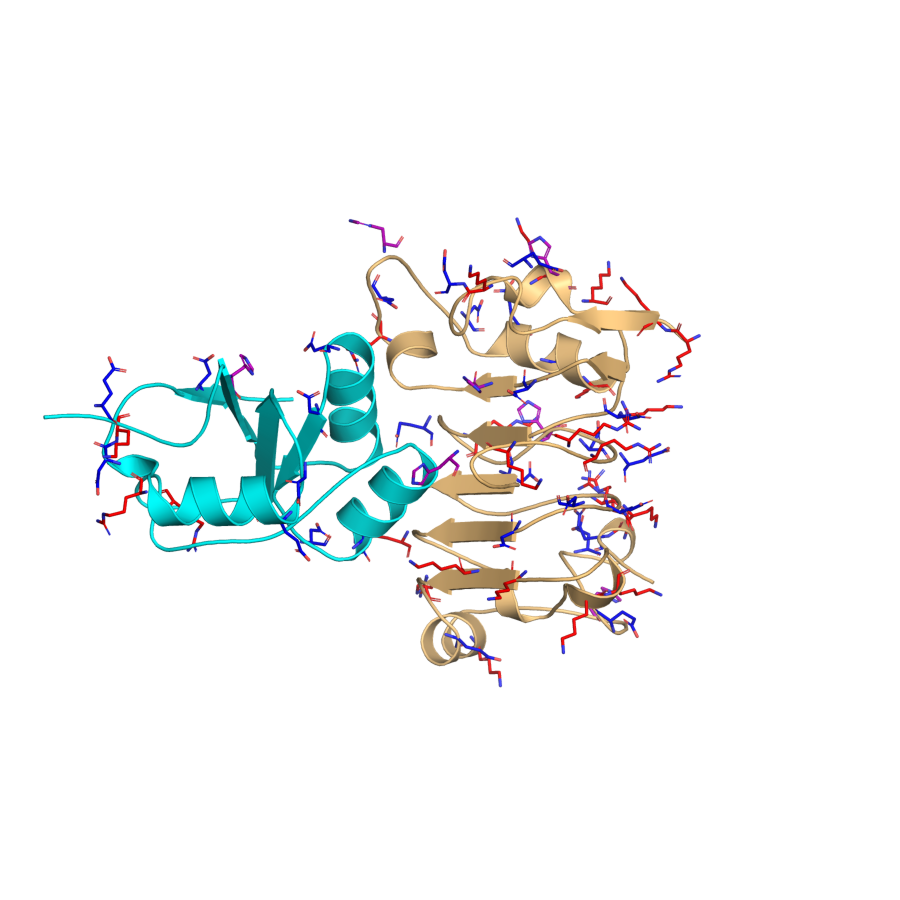</a><br>ipSAE **0.824** · Kd **1.53 nM**<br>H37/H100 pKa **7.503 / 7.491** | <a href="candidates/2026-10-07_current-top20_001/models/07_Human_EGFR_Human_EGFR_157_model_5/Mouse.png">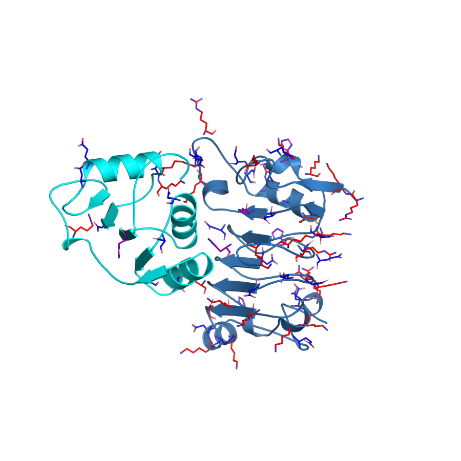</a><br>ipSAE **0.881** · Kd **1.52 nM**<br>H37/H100 pKa **6.961 / 6.870** |
| 08 | [Novo-0754](candidates/2026-10-07_current-top20_001/models/08_DD1_Human_EGFR_APNovo_0754/Human.png)<br>Near-window<br>Stable at all shifts | <a href="candidates/2026-10-07_current-top20_001/models/08_DD1_Human_EGFR_APNovo_0754/Human.png">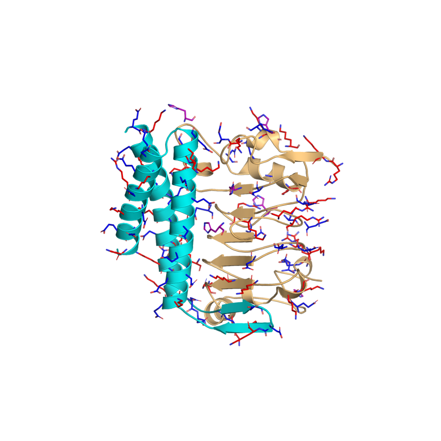</a><br>ipSAE **0.933** · Kd **156 nM**<br>H37/H100 pKa **7.364 / 6.989** | <a href="candidates/2026-10-07_current-top20_001/models/08_DD1_Human_EGFR_APNovo_0754/Mouse.png">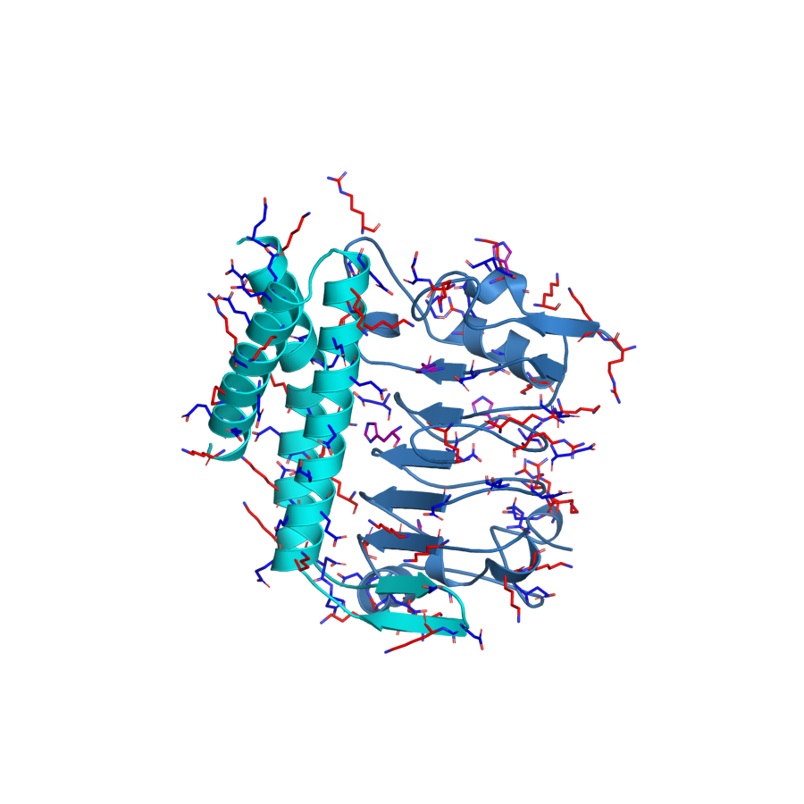</a><br>ipSAE **0.927** · Kd **111 nM**<br>H37/H100 pKa **7.514 / 7.030** |
| 09 | [DD1-062/A73R](candidates/2026-10-07_current-top20_001/models/09_DD1_062_A73R/Human.png)<br>Near-window<br>Stable at all shifts | <a href="candidates/2026-10-07_current-top20_001/models/09_DD1_062_A73R/Human.png">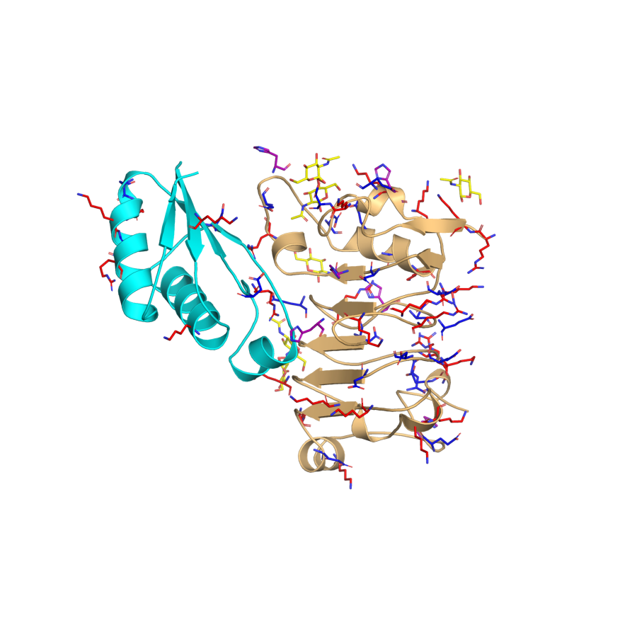</a><br>ipSAE **0.774** · Kd **164 nM**<br>H37/H100 pKa **6.374 / 6.594** | <a href="candidates/2026-10-07_current-top20_001/models/09_DD1_062_A73R/Mouse.png">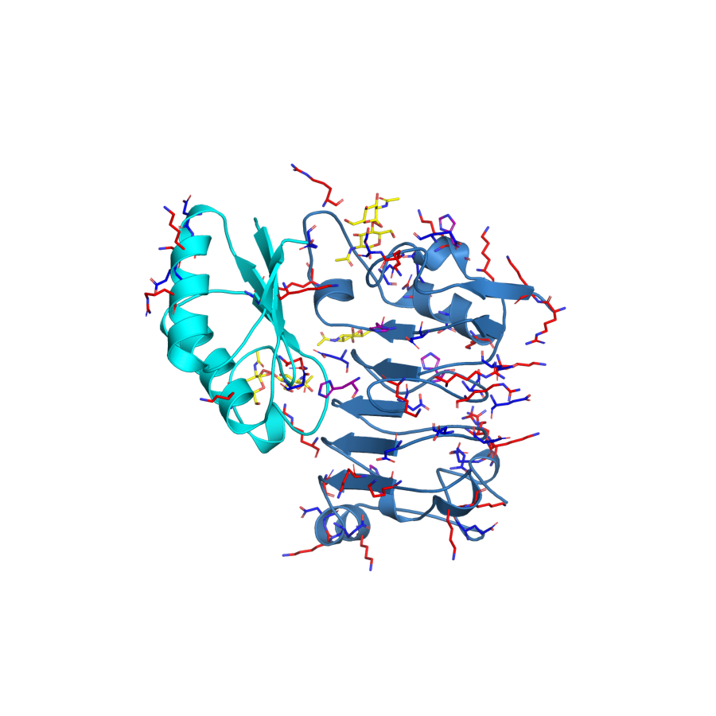</a><br>ipSAE **0.844** · Kd **182 nM**<br>H37/H100 pKa **6.637 / 6.962** |
| 10 | [D46-V8G](candidates/2026-10-07_current-top20_001/models/10_D46_130_V8G/Human.png)<br>Near-window<br>Stable at all shifts | <a href="candidates/2026-10-07_current-top20_001/models/10_D46_130_V8G/Human.png">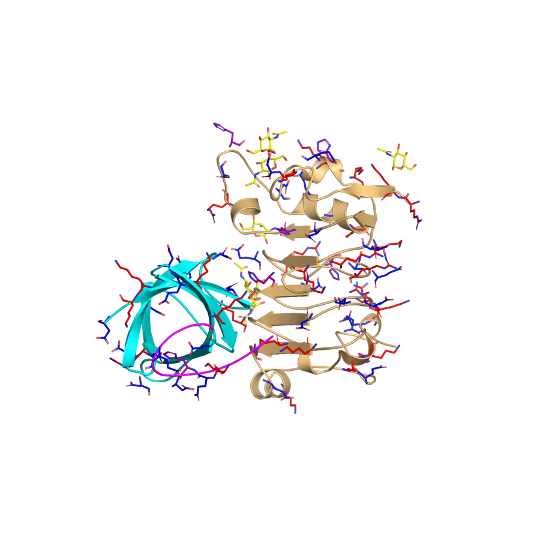</a><br>ipSAE **0.412** · Kd **181 nM**<br>H37/H100 pKa **6.816 / 7.579** | <a href="candidates/2026-10-07_current-top20_001/models/10_D46_130_V8G/Mouse.png">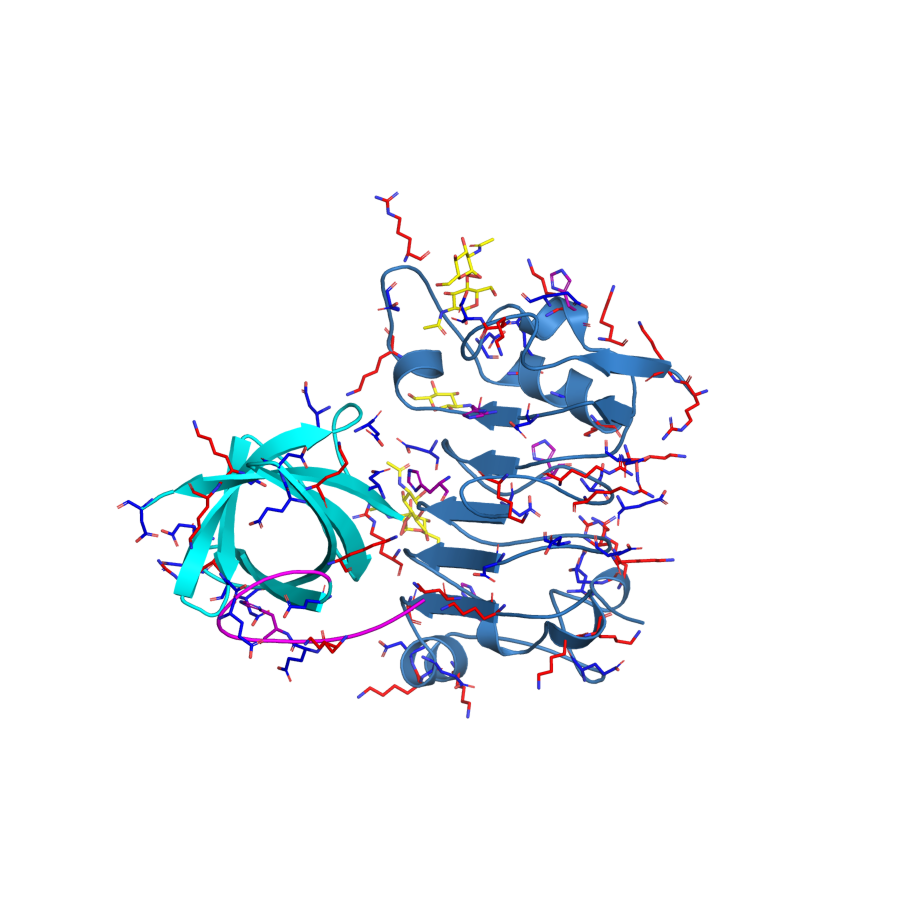</a><br>ipSAE **0.184** · Kd **148 nM**<br>H37/H100 pKa **6.901 / 6.540** |
| 11 | [ASP8m1-11/m3](candidates/2026-10-07_current-top20_001/models/11_design_DD1_Human_ASP_pair_8_model_1_11_model_3/Human.png)<br>Near-window<br>Stable at all shifts | <a href="candidates/2026-10-07_current-top20_001/models/11_design_DD1_Human_ASP_pair_8_model_1_11_model_3/Human.png">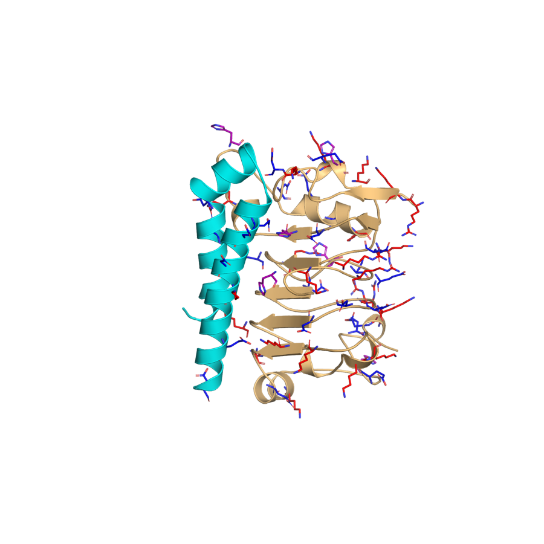</a><br>ipSAE **0.907** · Kd **46.3 nM**<br>H37/H100 pKa **7.183 / 6.424** | <a href="candidates/2026-10-07_current-top20_001/models/11_design_DD1_Human_ASP_pair_8_model_1_11_model_3/Mouse.png">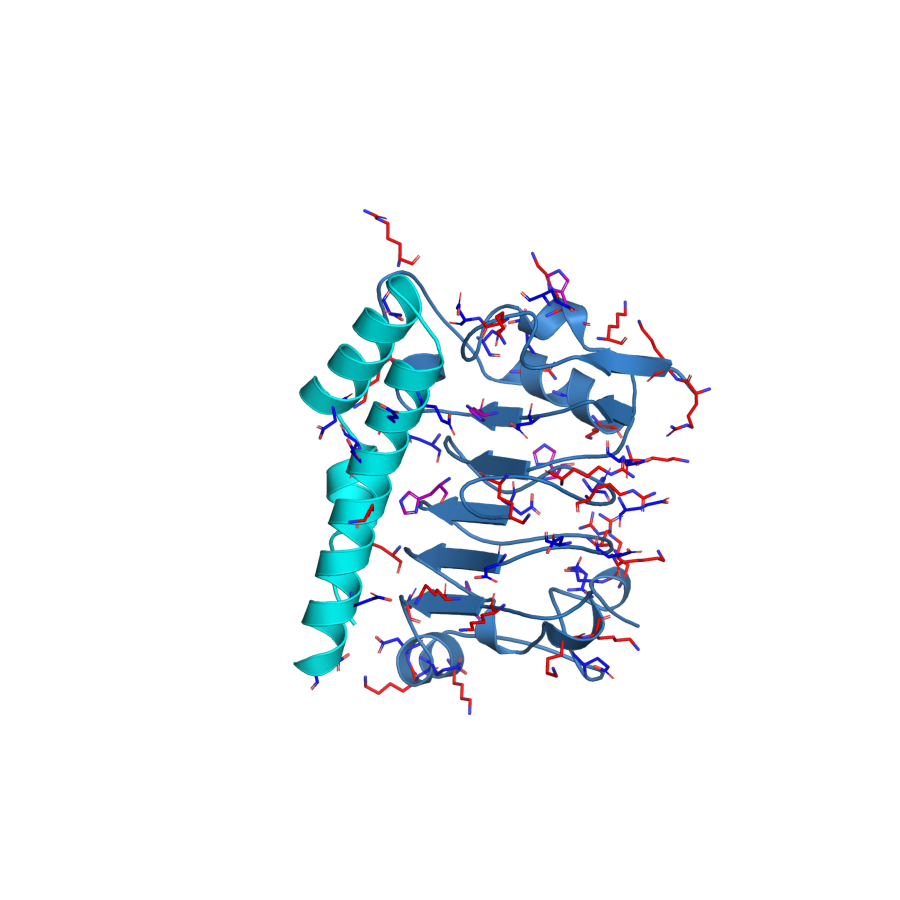</a><br>ipSAE **0.837** · Kd **105 nM**<br>H37/H100 pKa **6.083 / 7.095** |
| 12 | [ASP8m1-22/m1](candidates/2026-10-07_current-top20_001/models/12_design_DD1_Human_ASP_pair_8_model_1_22_model_1/Human.png)<br>Near-window<br>Stable at all shifts | <a href="candidates/2026-10-07_current-top20_001/models/12_design_DD1_Human_ASP_pair_8_model_1_22_model_1/Human.png">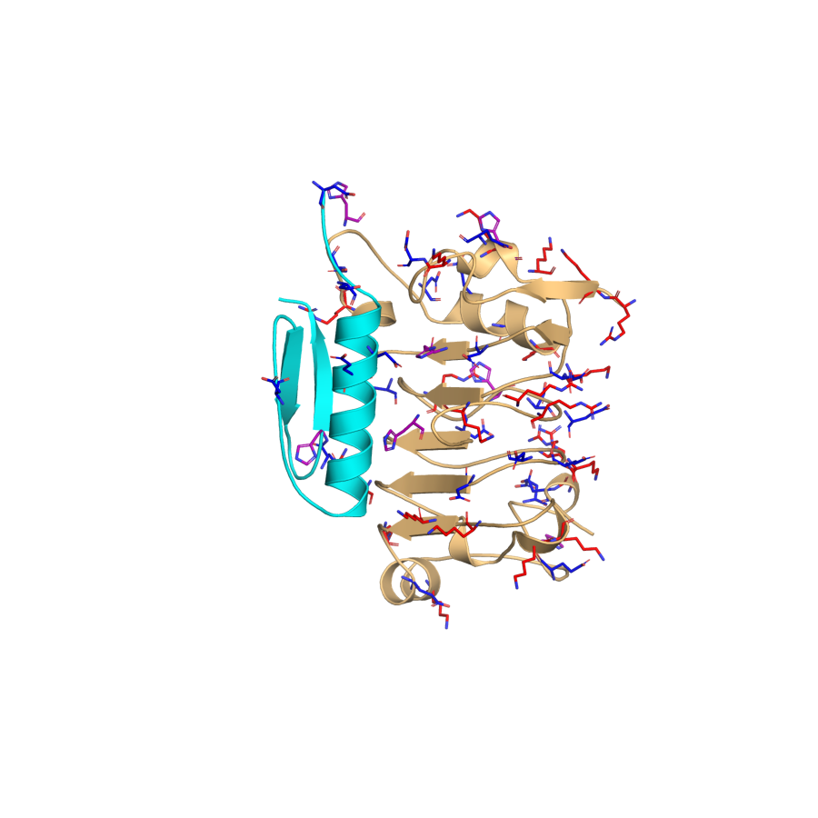</a><br>ipSAE **0.915** · Kd **36.3 nM**<br>H37/H100 pKa **6.141 / 6.655** | <a href="candidates/2026-10-07_current-top20_001/models/12_design_DD1_Human_ASP_pair_8_model_1_22_model_1/Mouse.png">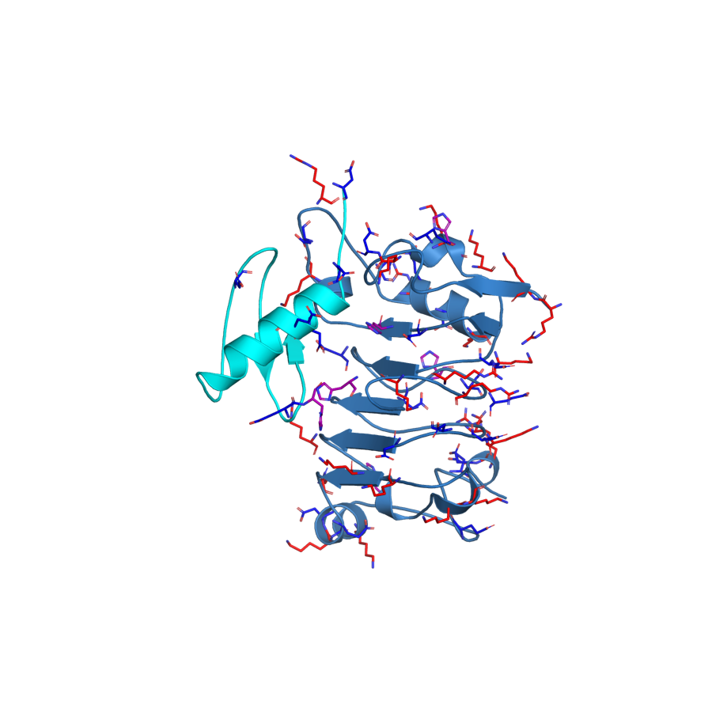</a><br>ipSAE **0.852** · Kd **109 nM**<br>H37/H100 pKa **6.763 / 8.019** |
| 13 | [F42/m7](candidates/2026-10-07_current-top20_001/models/13_Human_EGFR_Human_EGFR_42_model_7/Human.png)<br>Near-window<br>Stable at all shifts | <a href="candidates/2026-10-07_current-top20_001/models/13_Human_EGFR_Human_EGFR_42_model_7/Human.png">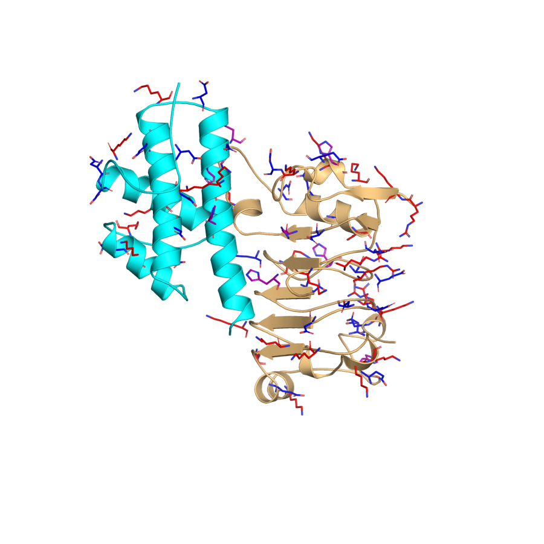</a><br>ipSAE **0.835** · Kd **172 nM**<br>H37/H100 pKa **6.777 / 6.126** | <a href="candidates/2026-10-07_current-top20_001/models/13_Human_EGFR_Human_EGFR_42_model_7/Mouse.png">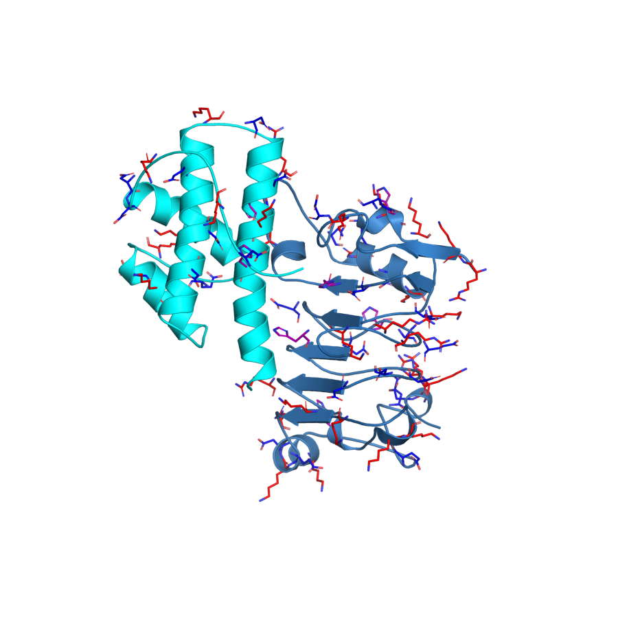</a><br>ipSAE **0.820** · Kd **213 nM**<br>H37/H100 pKa **6.049 / 5.819** |
| 14 | [F964/m7](candidates/2026-10-07_current-top20_001/models/14_Human_EGFR_Human_EGFR_964_model_7/Human.png)<br>Near-window<br>Stable at all shifts | <a href="candidates/2026-10-07_current-top20_001/models/14_Human_EGFR_Human_EGFR_964_model_7/Human.png">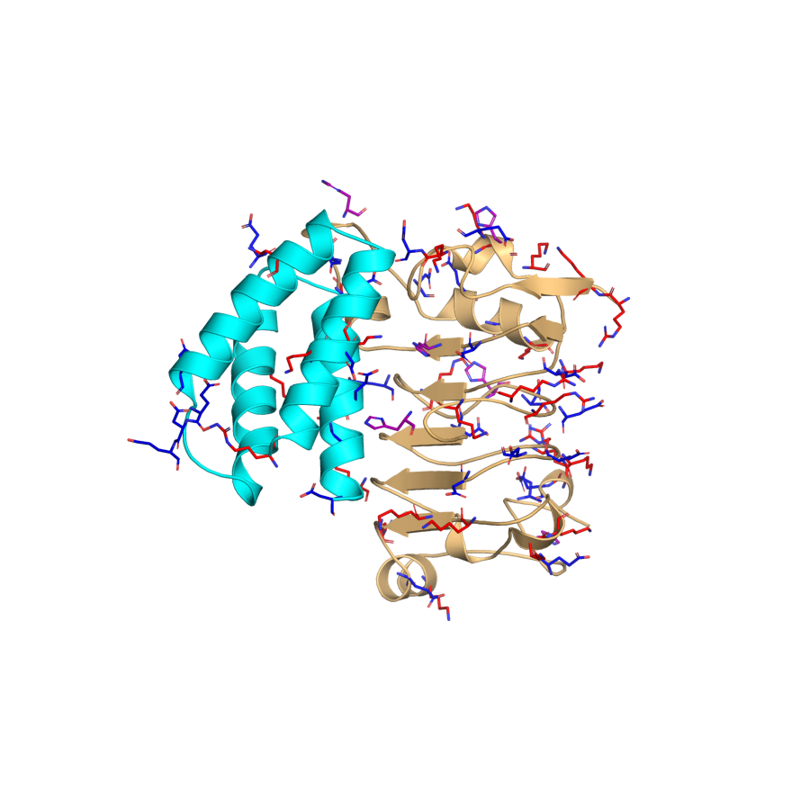</a><br>ipSAE **0.884** · Kd **105 nM**<br>H37/H100 pKa **5.786 / 5.987** | <a href="candidates/2026-10-07_current-top20_001/models/14_Human_EGFR_Human_EGFR_964_model_7/Mouse.png">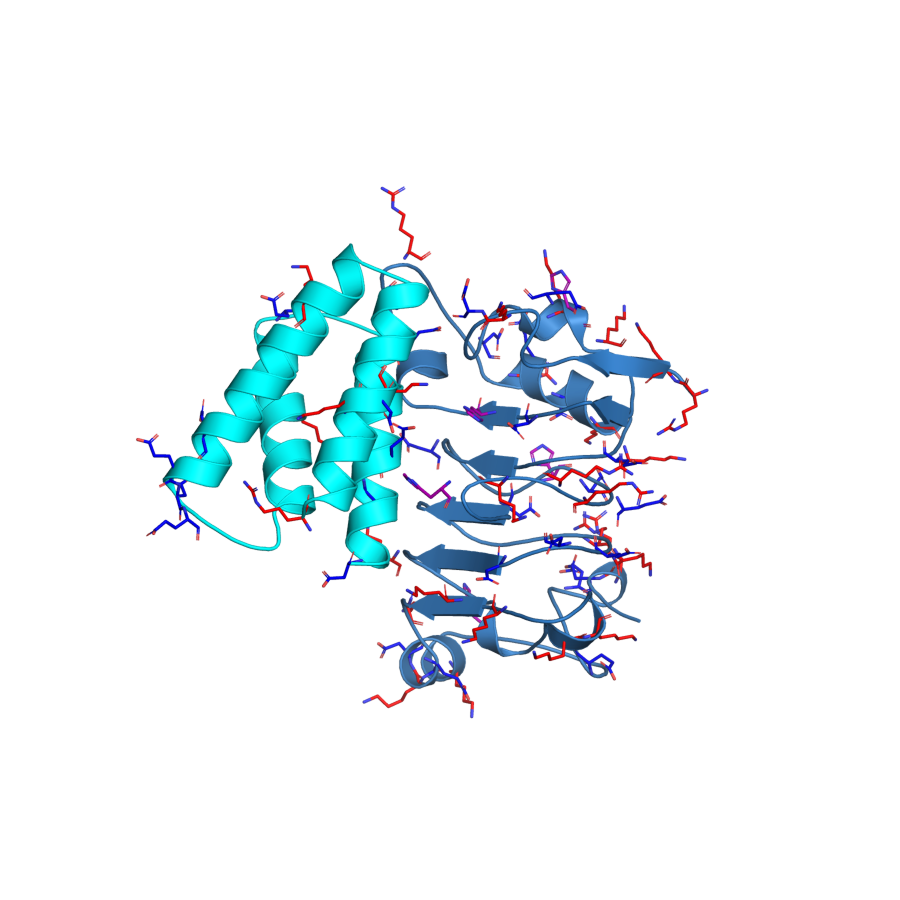</a><br>ipSAE **0.862** · Kd **122 nM**<br>H37/H100 pKa **6.794 / 5.971** |
| 15 | [Novo-0026/0576](candidates/2026-10-07_current-top20_001/models/15_APNovo_0026_phswitch_0576/Human.png)<br>Near-window<br>Stable at all shifts | <a href="candidates/2026-10-07_current-top20_001/models/15_APNovo_0026_phswitch_0576/Human.png">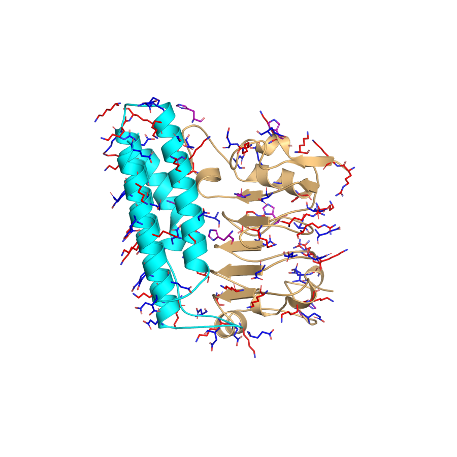</a><br>ipSAE **0.933** · Kd **183 nM**<br>H37/H100 pKa **7.012 / 5.777** | <a href="candidates/2026-10-07_current-top20_001/models/15_APNovo_0026_phswitch_0576/Mouse.png">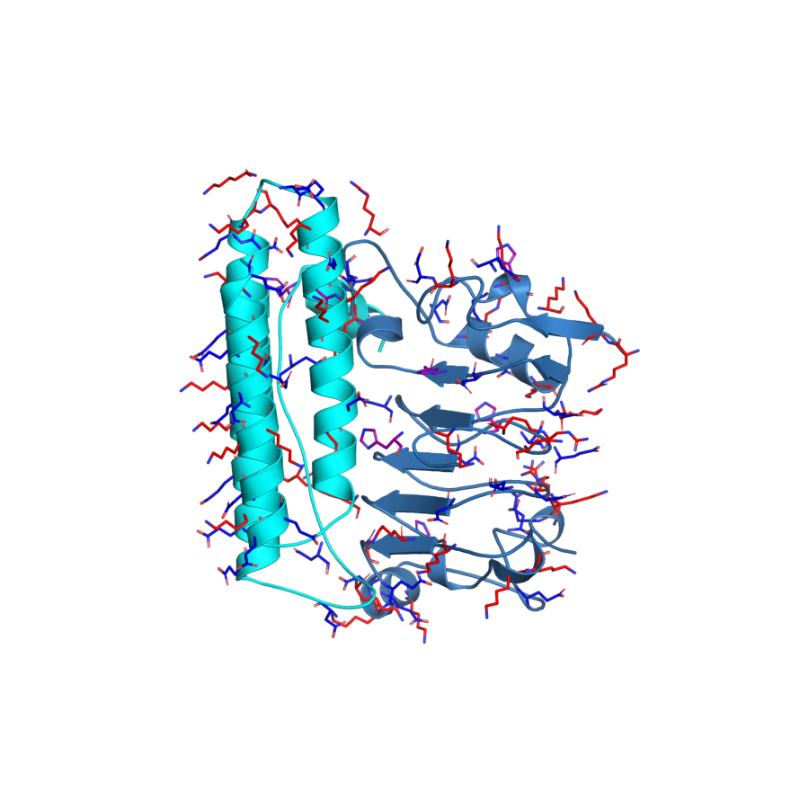</a><br>ipSAE **0.945** · Kd **2.1 nM**<br>H37/H100 pKa **7.059 / 5.885** |
| 16 | [LF-961](candidates/2026-10-07_current-top20_001/models/16_Ligand_AI_b6a74871_Design_961/Human.png)<br>Near-window<br>Stable at all shifts | <a href="candidates/2026-10-07_current-top20_001/models/16_Ligand_AI_b6a74871_Design_961/Human.png">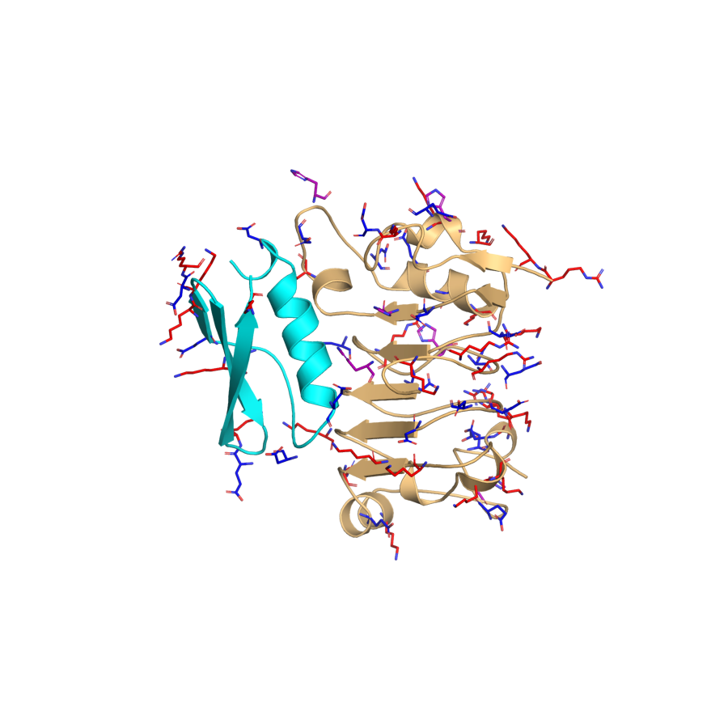</a><br>ipSAE **0.934** · Kd **116 nM**<br>H37/H100 pKa **6.884 / 6.557** | <a href="candidates/2026-10-07_current-top20_001/models/16_Ligand_AI_b6a74871_Design_961/Mouse.png">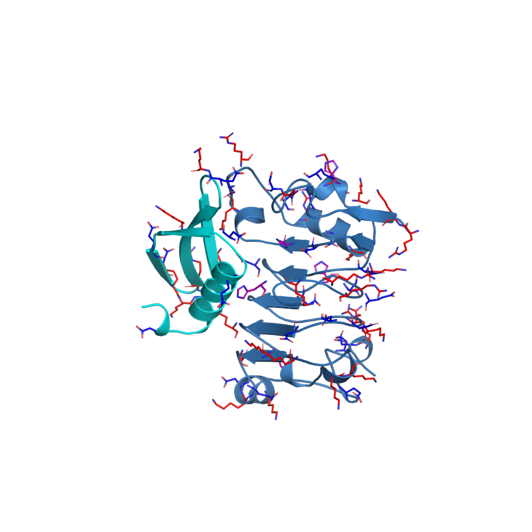</a><br>ipSAE **0.484** · Kd **138 nM**<br>H37/H100 pKa **5.711 / 7.452** |
| 17 | [DD1-062](candidates/2026-10-07_current-top20_001/models/17_DD1_062/Human.png)<br>Near-window<br>Stable at all shifts | <a href="candidates/2026-10-07_current-top20_001/models/17_DD1_062/Human.png">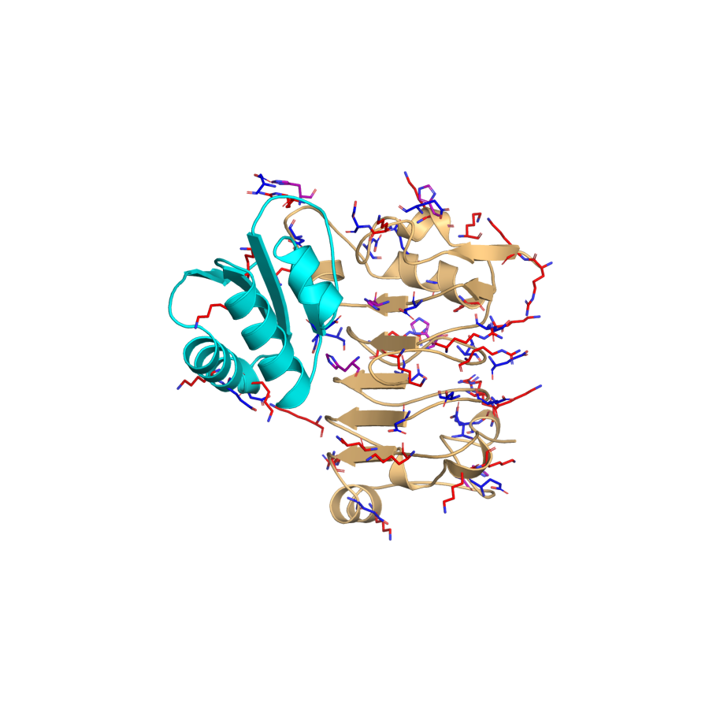</a><br>ipSAE **0.687** · Kd **212 nM**<br>H37/H100 pKa **6.762 / 8.189** | <a href="candidates/2026-10-07_current-top20_001/models/17_DD1_062/Mouse.png">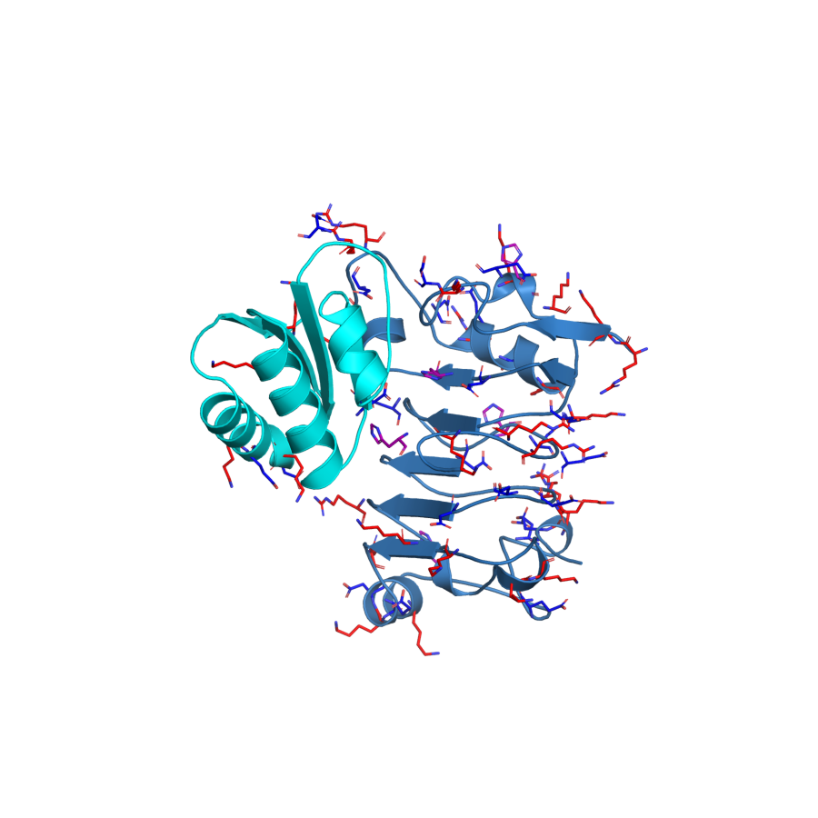</a><br>ipSAE **0.825** · Kd **207 nM**<br>H37/H100 pKa **7.777 / 7.902** |
| 18 | [Novo-0293/0488](candidates/2026-10-07_current-top20_001/models/18_APNovo_0293_phswitch_0488/Human.png)<br>Near-window<br>Stable at all shifts | <a href="candidates/2026-10-07_current-top20_001/models/18_APNovo_0293_phswitch_0488/Human.png">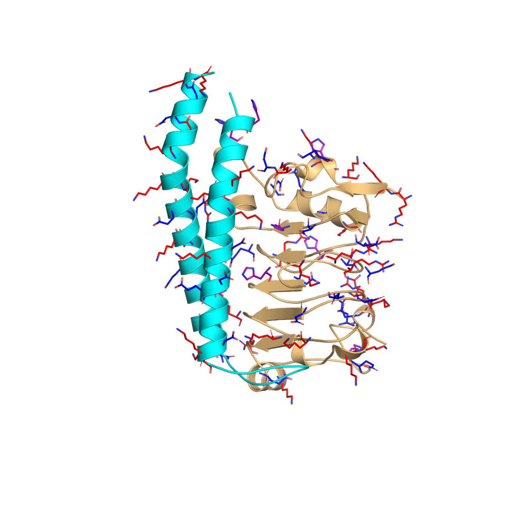</a><br>ipSAE **0.943** · Kd **82.2 nM**<br>H37/H100 pKa **5.552 / 5.972** | <a href="candidates/2026-10-07_current-top20_001/models/18_APNovo_0293_phswitch_0488/Mouse.png">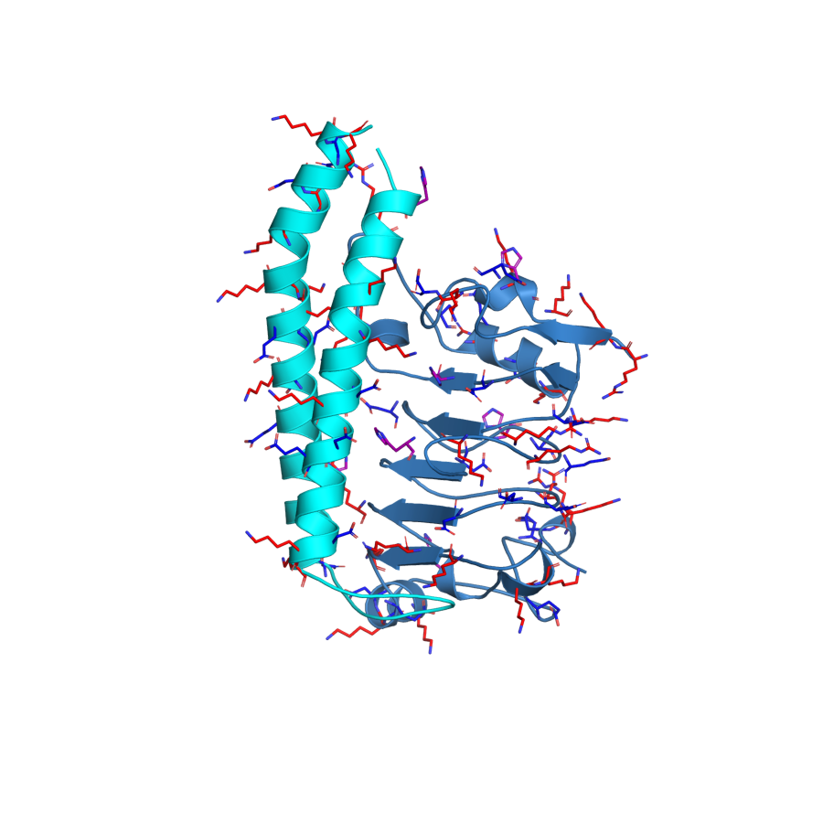</a><br>ipSAE **0.946** · Kd **28.8 nM**<br>H37/H100 pKa **7.010 / 6.078** |
| 19 | [F882/m1](candidates/2026-10-07_current-top20_001/models/19_Human_EGFR_Human_EGFR_882_model_1/Human.png)<br>Near-window<br>Stable at all shifts | <a href="candidates/2026-10-07_current-top20_001/models/19_Human_EGFR_Human_EGFR_882_model_1/Human.png">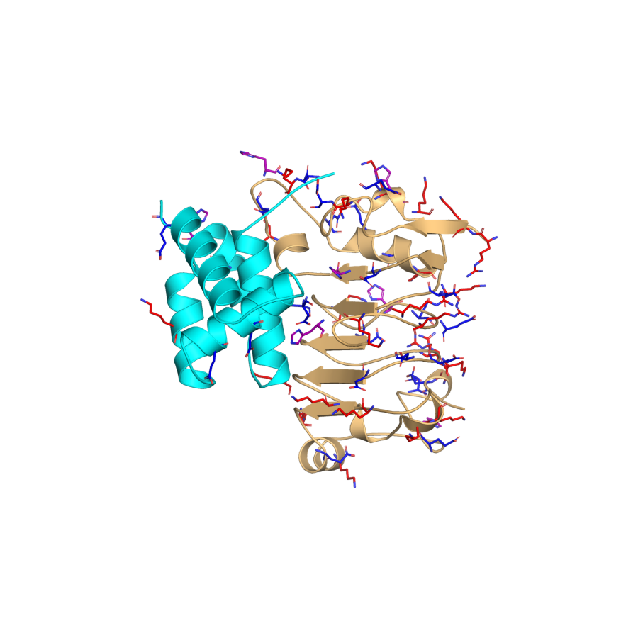</a><br>ipSAE **0.856** · Kd **18.8 nM**<br>H37/H100 pKa **6.912 / 7.989** | <a href="candidates/2026-10-07_current-top20_001/models/19_Human_EGFR_Human_EGFR_882_model_1/Mouse.png">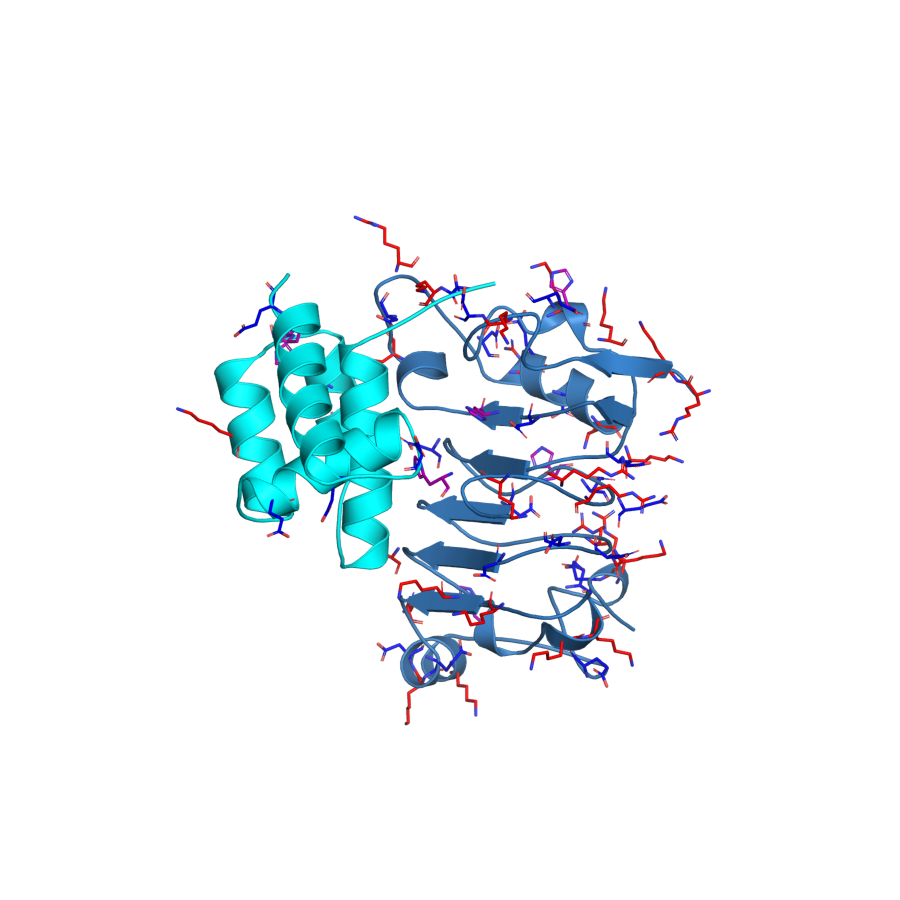</a><br>ipSAE **0.828** · Kd **84.8 nM**<br>H37/H100 pKa **7.159 / 5.524** |
| 20 | [F104/m0](candidates/2026-10-07_current-top20_001/models/20_Human_EGFR_Human_EGFR_104_model_0/Human.png)<br>Near-window<br>Stable at all shifts | <a href="candidates/2026-10-07_current-top20_001/models/20_Human_EGFR_Human_EGFR_104_model_0/Human.png">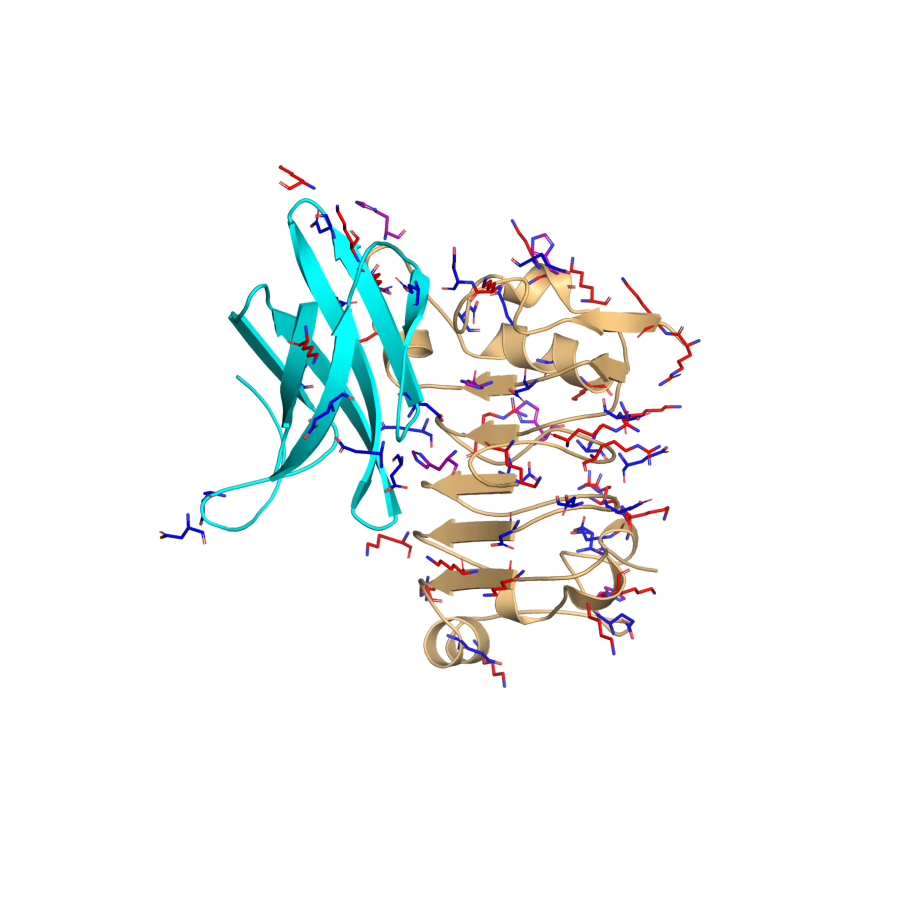</a><br>ipSAE **0.832** · Kd **125 nM**<br>H37/H100 pKa **7.448 / 5.519** | <a href="candidates/2026-10-07_current-top20_001/models/20_Human_EGFR_Human_EGFR_104_model_0/Mouse.png">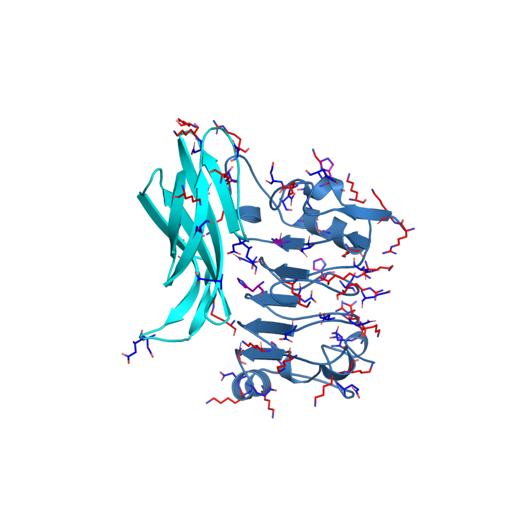</a><br>ipSAE **0.818** · Kd **77.1 nM**<br>H37/H100 pKa **7.529 / 6.219** |

<details>
<summary>Exact design identifiers for the current top 20</summary>

| Rank | Exact design identifier |
| ---: | --- |
| 1 | `Human_EGFR_Human_EGFR_747_model_4` |
| 2 | `Ligand_AI_b6a74871_Design_559` |
| 3 | `Human_EGFR_Human_EGFR_428_model_1` |
| 4 | `D46_130_V8S` |
| 5 | `Human_EGFR_Human_EGFR_126_model_4` |
| 6 | `LigandAI_559_phswitch_0061` |
| 7 | `Human_EGFR_Human_EGFR_157_model_5` |
| 8 | `DD1_Human_EGFR_APNovo_0754` |
| 9 | `DD1_062_A73R` |
| 10 | `D46_130_V8G` |
| 11 | `design_DD1_Human_ASP_pair_8_model_1_11_model_3` |
| 12 | `design_DD1_Human_ASP_pair_8_model_1_22_model_1` |
| 13 | `Human_EGFR_Human_EGFR_42_model_7` |
| 14 | `Human_EGFR_Human_EGFR_964_model_7` |
| 15 | `APNovo_0026_phswitch_0576` |
| 16 | `Ligand_AI_b6a74871_Design_961` |
| 17 | `DD1_062` |
| 18 | `APNovo_0293_phswitch_0488` |
| 19 | `Human_EGFR_Human_EGFR_882_model_1` |
| 20 | `Human_EGFR_Human_EGFR_104_model_0` |

</details>

Quality gives equal empirical percentile weights to higher **minimum human/mouse ipSAE** and lower **maximum human/mouse Kd**, using the 103 eligible sequences. DeltaG receives no second weight alongside Kd. Potts direction and pKa proximity remain separate from predicted affinity; DeltaForge accepted no pH input. Near-window ranking places pKa distance before quality and imposes no diversity constraint. Full-precision CSVs determine order; README values are rounded.

Methods: DeltaForge scorer and LigandForge generator on the LigandAI platform, [Watson (2026)](https://doi.org/10.64898/2026.03.14.711748); JustHISpKa, [Hogues, Wei and Sulea (2025)](https://doi.org/10.1021/acs.jcim.4c01957); Foundry-lineage RFdiffusion3, [RosettaCommons Foundry](https://github.com/RosettaCommons/foundry), [Corley et al.](https://doi.org/10.1101/2025.08.14.670328) and [Butcher et al.](https://doi.org/10.1101/2025.09.18.676967); standalone Proton-PottsMPNN redesigns, [Jacobsen et al.](https://doi.org/10.64898/2026.09.30.755438). Model and checkpoint pins are unchanged.

## Repository workflow

Start with `python3 scripts/workspace.py show` and [overview.md](overview.md).
Use `history` to browse the 11 existing campaigns. Read
[workspace instructions](docs/WORKSPACE.md) before new work.

```text
project.json                    Target and chosen pipeline responsibilities
workflow.lock.json              Deliberately pinned shared code and guides
campaigns/<campaign>/
  campaign.json                 Scientific question and recipe
  01_staging/ ... 04_analysis/   Preserved historical packages
  catalog.json / artifacts.jsonl Original paths, file counts and SHA-256 checksums
  runs/<YYYY-MM-DD_label_NNN>/
    run.json                    Immutable input/settings identity and parent link
    01_staging/                 Frozen native inputs
    02_design/                  Design results
    03_filtering/               Predictions, scores and filtering evidence
    04_analysis/                Comparisons, plots and reports
    state.json                  Recorded progress
    receipts/                   Verified transport and execution observations
registry/                       Candidate identity and source-backed evidence
drafts/                         Editable inputs
submissions/                    Frozen reviewed selection packages
local/                          Private bindings and migration receipts
```

Week1 and Week2 use the same new-run skeleton. Week1 also has eleven imported
historical campaigns, each with the four stage folders. Shared targets, archived
helpers, engine checkouts and original registry evidence remain in `reference/`.
Use `python3 scripts/artifacts.py list` for compact campaign counts, and
`locate ORIGINAL_PATH --verify` to locate an old path and report its current checksum.
The private map also resolves retired navigation shortcuts without duplicate data.

Native execution adapters for the new run paths still require validation before
scientific compute. No inference was submitted during organization.

Git tracks reviewed source, docs, pins and campaign configuration. Large models,
structures, predictions, renderings, logs, registry observations and private
settings stay outside Git. Fleet resolves their locations, verifies selected
downloads, and copies stable remote folders to the registered archive without
deleting working sources. A Git clone alone does not restore scientific data
or private bindings. Source with embedded site details remains local pending
parameterization; see the private migration receipt rather than publishing it.

Use stable `main`, a `work/YYYY-MM-DD_task-slug` branch for each bounded task,
and a separate task worktree. Changed inputs/settings create a successor run;
update workflow pins deliberately. Preserve explicit user scientific choices.

Read [challenge](docs/CHALLENGE.md) and [historical navigation](docs/HISTORY.md).
