# EGFR test panel — 20 designs

## Placeholder panel of 20 designs

The saved **Test Submission** panel is a random sample of 20 exact, deduplicated sequences. **It has not been submitted and is not the final scientific selection.** Order matches the saved test panel. Replace it with a reviewed successor panel when the final set is frozen.

Each species cell shows **ipSAE · predicted DeltaForge Kd in nM**, then **EGFR H37 / H100 pKa**. H37/H100 are EGFR D3 sites (historical full positions 346/409), not binder histidines. pKa scopes differ by campaign; candidate pages preserve context, status, and conditional results. These models and scores do not establish pH-selective binding.

[Panel CSV](test-panel.csv) · [All metrics](metrics.csv) · [Selection](selection.json) · [Manifest](manifest.json)

| # | Design and evidence | Human EGFR D3 | Mouse EGFR D3 |
| ---: | --- | --- | --- |
| 01 | [DD1_062 / 0557](DD1_062_phswitch_0557/) | <a href="DD1_062_phswitch_0557/Human.png">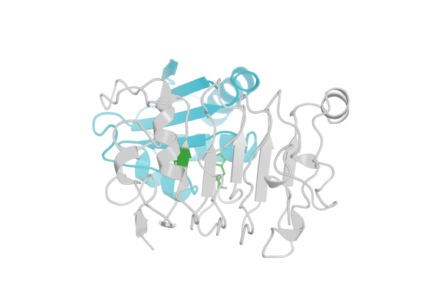</a> ipSAE **0.882** · Kd **97.17 nM** pKa 4.08 / 5.09 [PNG](DD1_062_phswitch_0557/Human.png) · [PSE](DD1_062_phswitch_0557/Human.pse) | <a href="DD1_062_phswitch_0557/Mouse.png">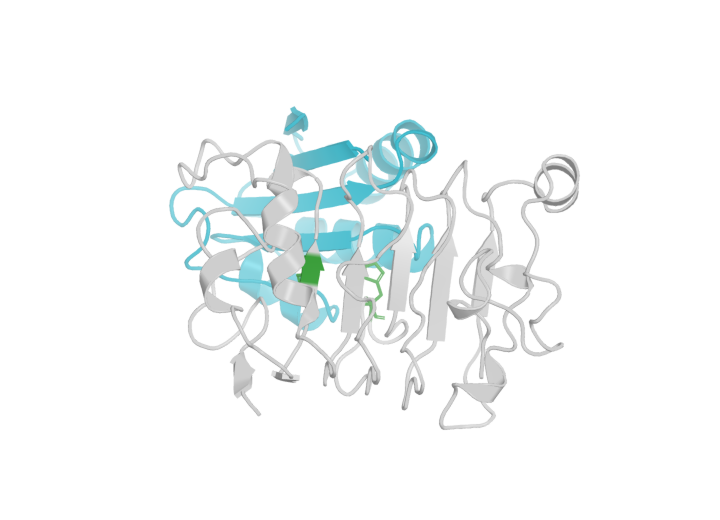</a> ipSAE **0.881** · Kd **83.38 nM** pKa 4.51 / 5.42 [PNG](DD1_062_phswitch_0557/Mouse.png) · [PSE](DD1_062_phswitch_0557/Mouse.pse) |
| 02 | [LigandAI 927](Ligand_AI_b6a74871_Design_927/) | <a href="Ligand_AI_b6a74871_Design_927/Human.png">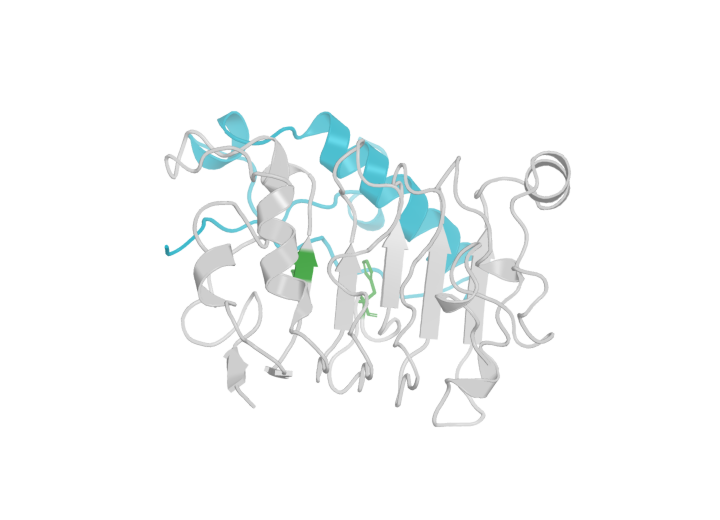</a> ipSAE **0.934** · Kd **55.02 nM** pKa 3.49 / 4.24 [PNG](Ligand_AI_b6a74871_Design_927/Human.png) · [PSE](Ligand_AI_b6a74871_Design_927/Human.pse) | <a href="Ligand_AI_b6a74871_Design_927/Mouse.png">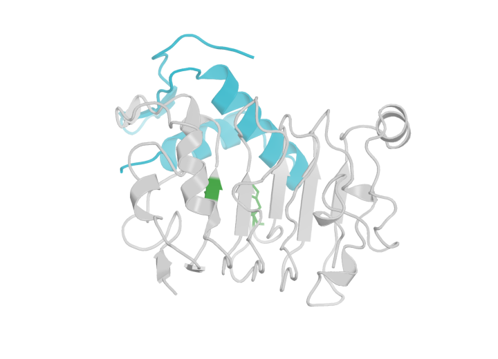</a> ipSAE **0.876** · Kd **232.73 nM** pKa 3.59 / 4.61 [PNG](Ligand_AI_b6a74871_Design_927/Mouse.png) · [PSE](Ligand_AI_b6a74871_Design_927/Mouse.pse) |
| 03 | [DD1_062 / 0765](DD1_062_phswitch_0765/) | <a href="DD1_062_phswitch_0765/Human.png">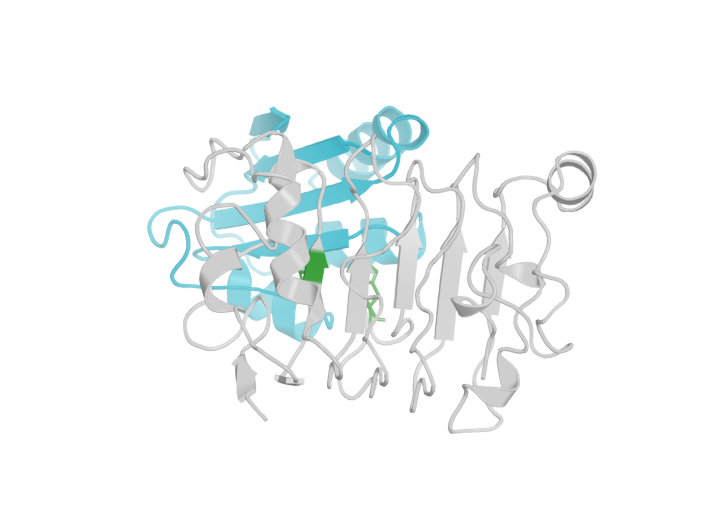</a> ipSAE **0.869** · Kd **82.25 nM** pKa 4.35 / 6.48 [PNG](DD1_062_phswitch_0765/Human.png) · [PSE](DD1_062_phswitch_0765/Human.pse) | <a href="DD1_062_phswitch_0765/Mouse.png">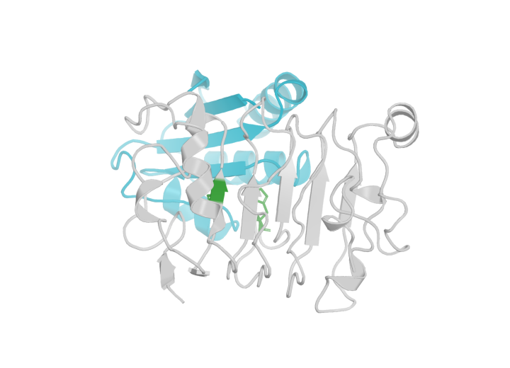</a> ipSAE **0.868** · Kd **42.19 nM** pKa 4.39 / 6.73 [PNG](DD1_062_phswitch_0765/Mouse.png) · [PSE](DD1_062_phswitch_0765/Mouse.pse) |
| 04 | [D46-130 fusion](rank_05_D46_130_model_1_chain_A/) | <a href="rank_05_D46_130_model_1_chain_A/Human.png">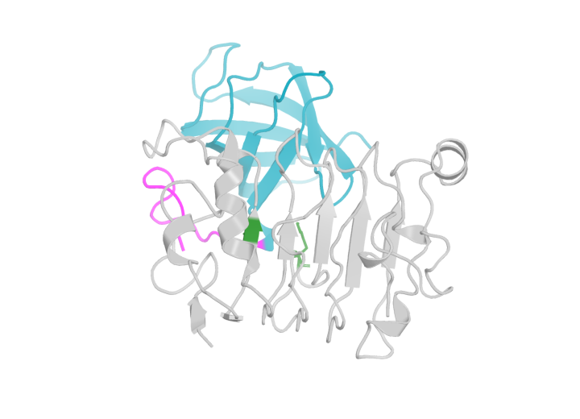</a> ipSAE **0.468** · Kd **34.54 nM** pKa 4.40 / 7.03 [PNG](rank_05_D46_130_model_1_chain_A/Human.png) · [PSE](rank_05_D46_130_model_1_chain_A/Human.pse) | <a href="rank_05_D46_130_model_1_chain_A/Mouse.png">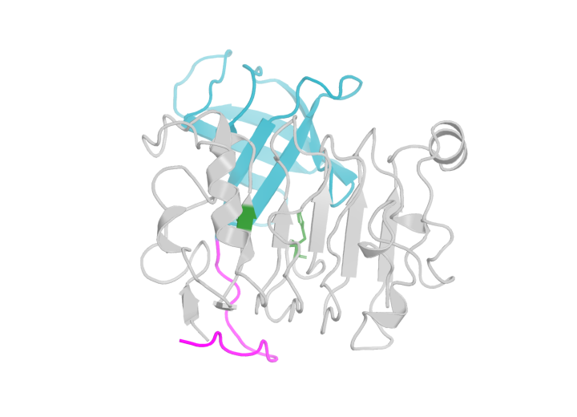</a> ipSAE **0.698** · Kd **130.35 nM** pKa 4.33 / — [PNG](rank_05_D46_130_model_1_chain_A/Mouse.png) · [PSE](rank_05_D46_130_model_1_chain_A/Mouse.pse) |
| 05 | [DD1_195 / 0043](DD1_195_phswitch_0043/) | <a href="DD1_195_phswitch_0043/Human.png">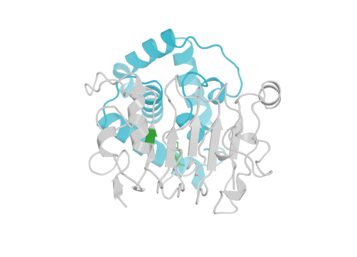</a> ipSAE **0.859** · Kd **40.04 nM** pKa 6.90 / 4.89 [PNG](DD1_195_phswitch_0043/Human.png) · [PSE](DD1_195_phswitch_0043/Human.pse) | <a href="DD1_195_phswitch_0043/Mouse.png">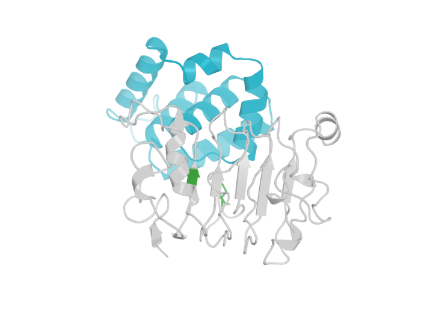</a> ipSAE **0.833** · Kd **69.19 nM** pKa 6.89 / 5.34 [PNG](DD1_195_phswitch_0043/Mouse.png) · [PSE](DD1_195_phswitch_0043/Mouse.pse) |
| 06 | [LigandAI 774](Ligand_AI_b6a74871_Design_774/) | <a href="Ligand_AI_b6a74871_Design_774/Human.png">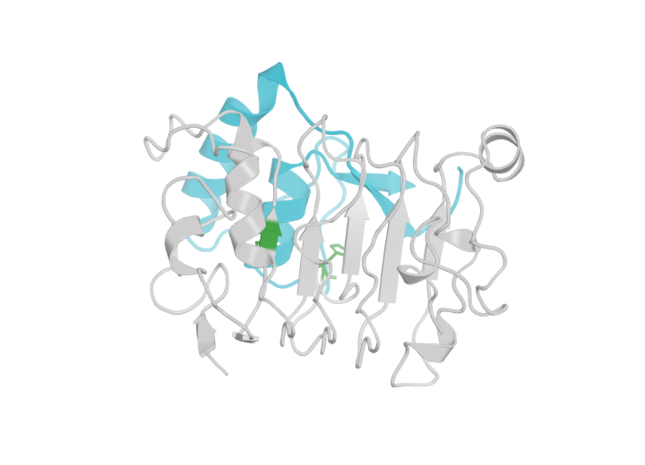</a> ipSAE **0.922** · Kd **71.48 nM** pKa 6.56 / 4.59 [PNG](Ligand_AI_b6a74871_Design_774/Human.png) · [PSE](Ligand_AI_b6a74871_Design_774/Human.pse) | <a href="Ligand_AI_b6a74871_Design_774/Mouse.png">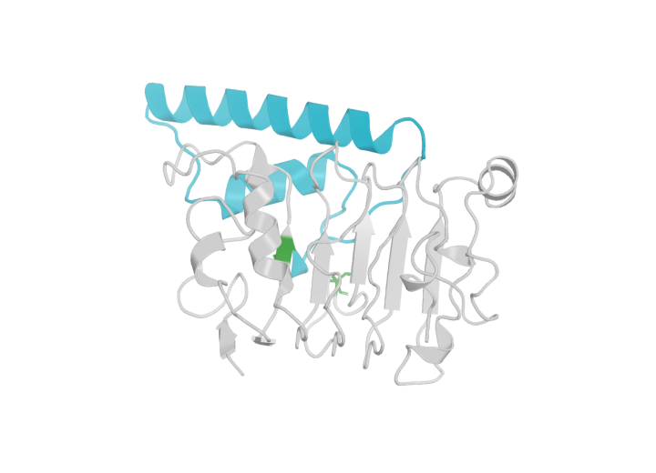</a> ipSAE **0.924** · Kd **85.28 nM** pKa 6.06 / 5.76 [PNG](Ligand_AI_b6a74871_Design_774/Mouse.png) · [PSE](Ligand_AI_b6a74871_Design_774/Mouse.pse) |
| 07 | [DD1_062](DD1_062/) | <a href="DD1_062/Human.png">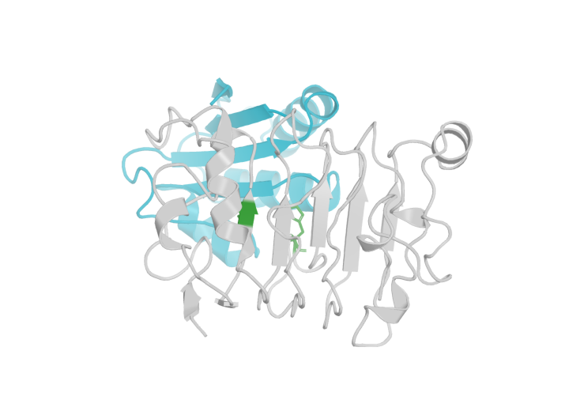</a> ipSAE **0.687** · Kd **212.24 nM** pKa 6.99 / 6.94 [PNG](DD1_062/Human.png) · [PSE](DD1_062/Human.pse) | <a href="DD1_062/Mouse.png">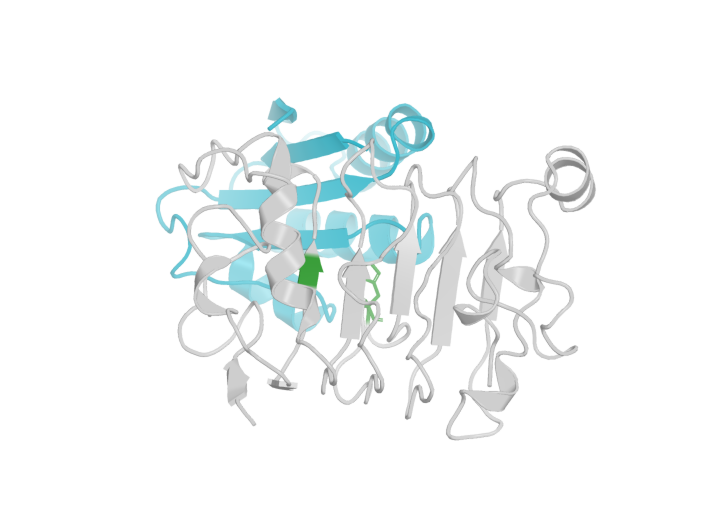</a> ipSAE **0.825** · Kd **207.45 nM** pKa 6.79 / 6.53 [PNG](DD1_062/Mouse.png) · [PSE](DD1_062/Mouse.pse) |
| 08 | [DD1_195](DD1_195/) | <a href="DD1_195/Human.png">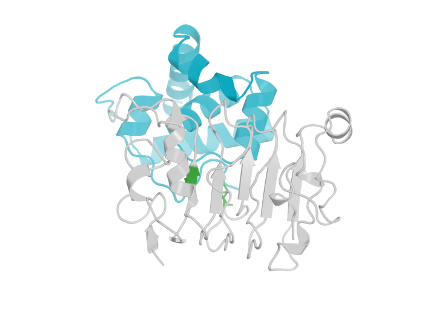</a> ipSAE **0.835** · Kd **56.72 nM** pKa 6.94 / 6.16 [PNG](DD1_195/Human.png) · [PSE](DD1_195/Human.pse) | <a href="DD1_195/Mouse.png">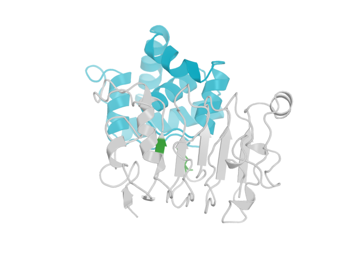</a> ipSAE **0.799** · Kd **72.50 nM** pKa 6.87 / 6.19 [PNG](DD1_195/Mouse.png) · [PSE](DD1_195/Mouse.pse) |
| 09 | [DD1_195 / 0096](DD1_195_phswitch_0096/) | <a href="DD1_195_phswitch_0096/Human.png">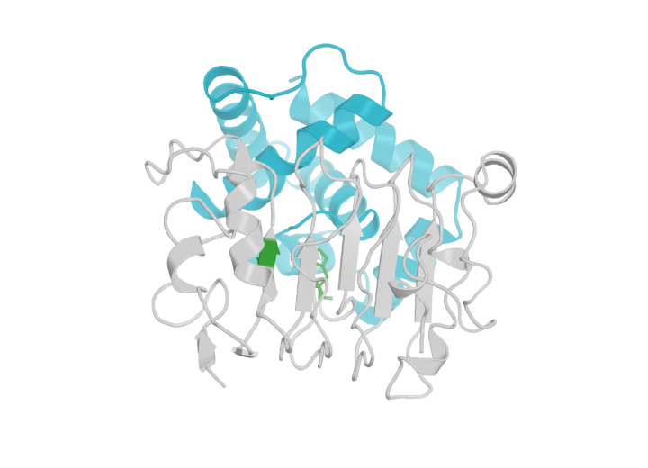</a> ipSAE **0.879** · Kd **167.82 nM** pKa 5.50 / 3.94 [PNG](DD1_195_phswitch_0096/Human.png) · [PSE](DD1_195_phswitch_0096/Human.pse) | <a href="DD1_195_phswitch_0096/Mouse.png">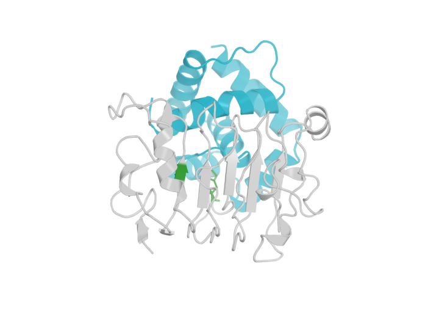</a> ipSAE **0.810** · Kd **159.16 nM** pKa 5.18 / 4.27 [PNG](DD1_195_phswitch_0096/Mouse.png) · [PSE](DD1_195_phswitch_0096/Mouse.pse) |
| 10 | [DD1_310 / 0217](DD1_310_phswitch_0217/) | <a href="DD1_310_phswitch_0217/Human.png">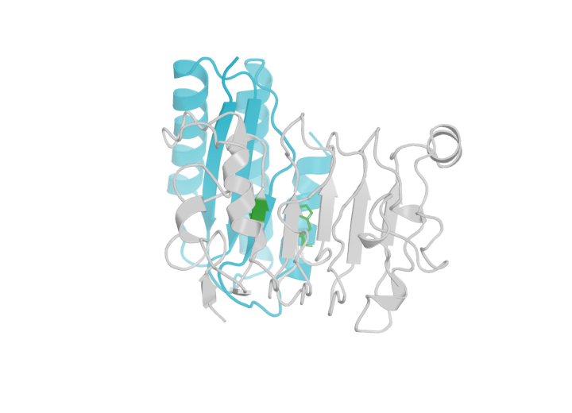</a> ipSAE **0.771** · Kd **20.75 nM** pKa 5.49 / 5.07 [PNG](DD1_310_phswitch_0217/Human.png) · [PSE](DD1_310_phswitch_0217/Human.pse) | <a href="DD1_310_phswitch_0217/Mouse.png">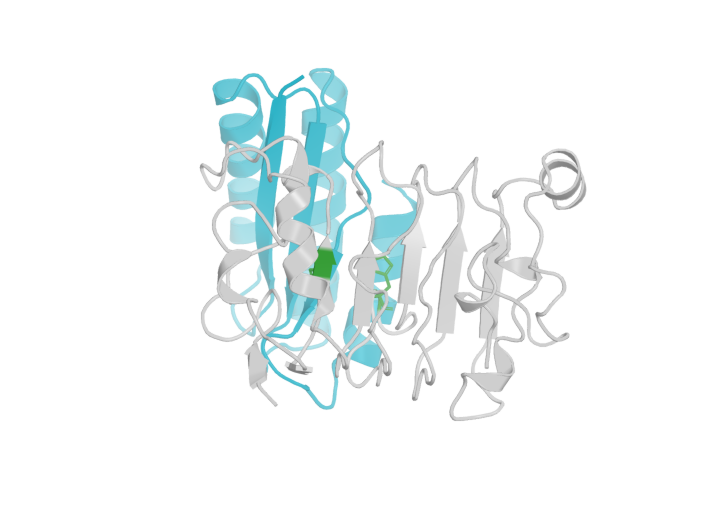</a> ipSAE **0.803** · Kd **45.45 nM** pKa 5.48 / 6.18 [PNG](DD1_310_phswitch_0217/Mouse.png) · [PSE](DD1_310_phswitch_0217/Mouse.pse) |
| 11 | [DD1_310 / 0504](DD1_310_phswitch_0504/) | <a href="DD1_310_phswitch_0504/Human.png">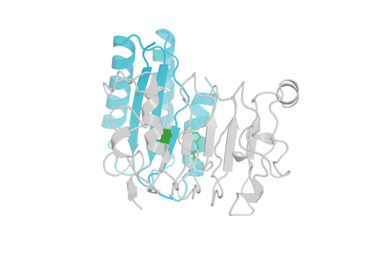</a> ipSAE **0.801** · Kd **69.53 nM** pKa 4.72 / 4.97 [PNG](DD1_310_phswitch_0504/Human.png) · [PSE](DD1_310_phswitch_0504/Human.pse) | <a href="DD1_310_phswitch_0504/Mouse.png">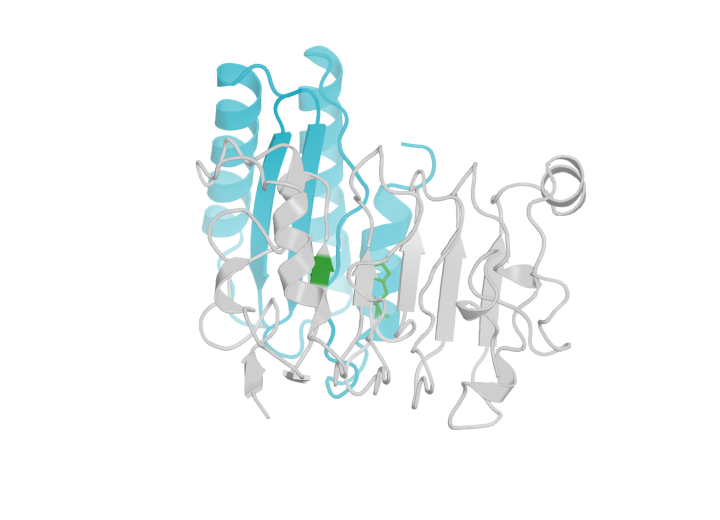</a> ipSAE **0.806** · Kd **84.57 nM** pKa 4.45 / 5.54 [PNG](DD1_310_phswitch_0504/Mouse.png) · [PSE](DD1_310_phswitch_0504/Mouse.pse) |
| 12 | [DD1_195 / 0591](DD1_195_phswitch_0591/) | <a href="DD1_195_phswitch_0591/Human.png">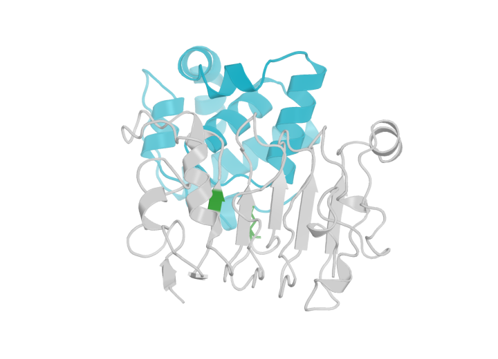</a> ipSAE **0.862** · Kd **136.74 nM** pKa 6.19 / 1.46 [PNG](DD1_195_phswitch_0591/Human.png) · [PSE](DD1_195_phswitch_0591/Human.pse) | <a href="DD1_195_phswitch_0591/Mouse.png">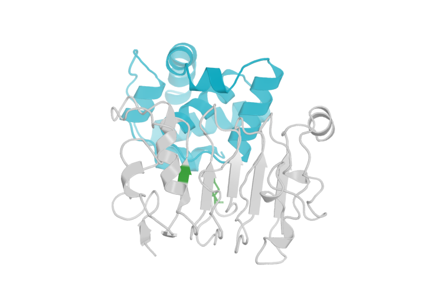</a> ipSAE **0.917** · Kd **113.16 nM** pKa 6.90 / 4.81 [PNG](DD1_195_phswitch_0591/Mouse.png) · [PSE](DD1_195_phswitch_0591/Mouse.pse) |
| 13 | [DD1_310 / 0946](DD1_310_phswitch_0946/) | <a href="DD1_310_phswitch_0946/Human.png">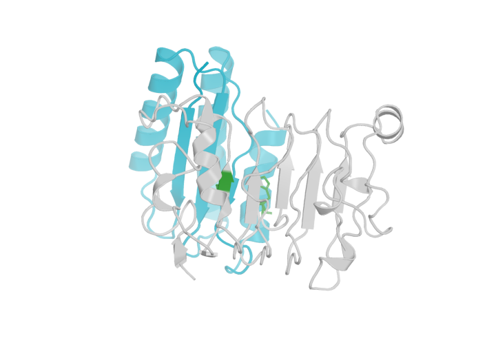</a> ipSAE **0.791** · Kd **32.25 nM** pKa 4.30 / 6.69 [PNG](DD1_310_phswitch_0946/Human.png) · [PSE](DD1_310_phswitch_0946/Human.pse) | <a href="DD1_310_phswitch_0946/Mouse.png">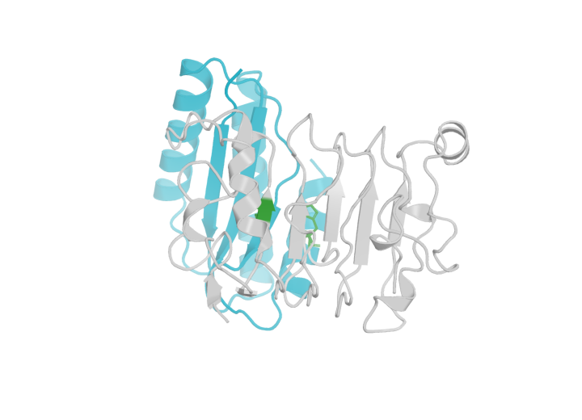</a> ipSAE **0.776** · Kd **0.93 nM** pKa 4.81 / 6.63 [PNG](DD1_310_phswitch_0946/Mouse.png) · [PSE](DD1_310_phswitch_0946/Mouse.pse) |
| 14 | [LigandAI 961](Ligand_AI_b6a74871_Design_961/) | <a href="Ligand_AI_b6a74871_Design_961/Human.png">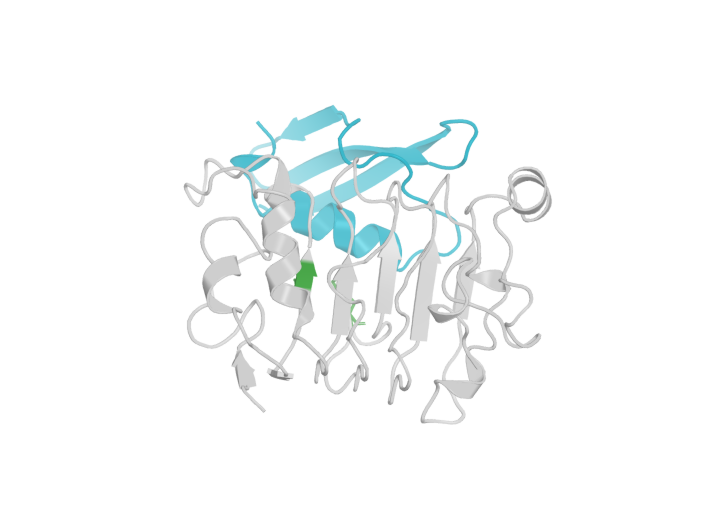</a> ipSAE **0.934** · Kd **116.12 nM** pKa 3.47 / 4.78 [PNG](Ligand_AI_b6a74871_Design_961/Human.png) · [PSE](Ligand_AI_b6a74871_Design_961/Human.pse) | <a href="Ligand_AI_b6a74871_Design_961/Mouse.png">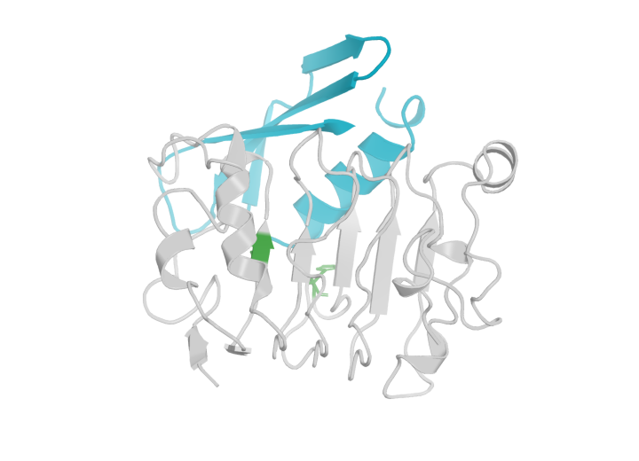</a> ipSAE **0.484** · Kd **138.08 nM** pKa 3.79 / 6.49 [PNG](Ligand_AI_b6a74871_Design_961/Mouse.png) · [PSE](Ligand_AI_b6a74871_Design_961/Mouse.pse) |
| 15 | [DD1_310 / 0516](DD1_310_phswitch_0516/) | <a href="DD1_310_phswitch_0516/Human.png">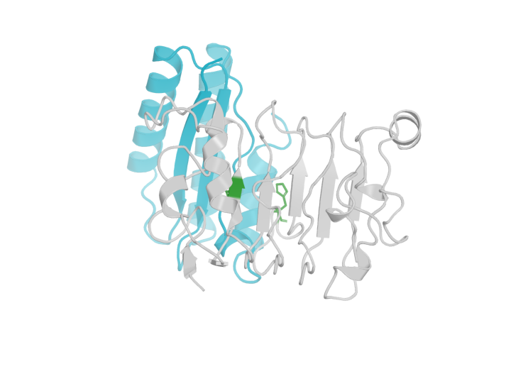</a> ipSAE **0.803** · Kd **44.73 nM** pKa 4.47 / 6.35 [PNG](DD1_310_phswitch_0516/Human.png) · [PSE](DD1_310_phswitch_0516/Human.pse) |  ipSAE **0.784** · Kd **99.24 nM** pKa 4.88 / 5.56 [PNG](DD1_310_phswitch_0516/Mouse.png) · [PSE](DD1_310_phswitch_0516/Mouse.pse) |
| 16 | [DD1_195 / 0458](DD1_195_phswitch_0458/) | <a href="DD1_195_phswitch_0458/Human.png">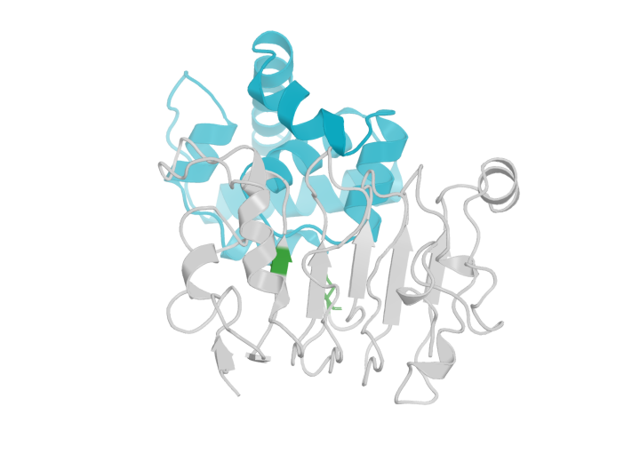</a> ipSAE **0.886** · Kd **767.51 nM** pKa 6.74 / 5.07 [PNG](DD1_195_phswitch_0458/Human.png) · [PSE](DD1_195_phswitch_0458/Human.pse) | <a href="DD1_195_phswitch_0458/Mouse.png">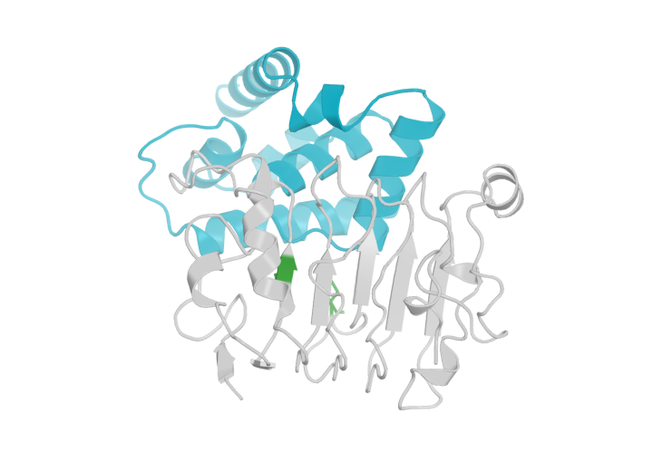</a> ipSAE **0.803** · Kd **21.54 nM** pKa 5.21 / 6.48 [PNG](DD1_195_phswitch_0458/Mouse.png) · [PSE](DD1_195_phswitch_0458/Mouse.pse) |
| 17 | [APNovo 0960](DD1_Human_EGFR_APNovo_0960/) | <a href="DD1_Human_EGFR_APNovo_0960/Human.png">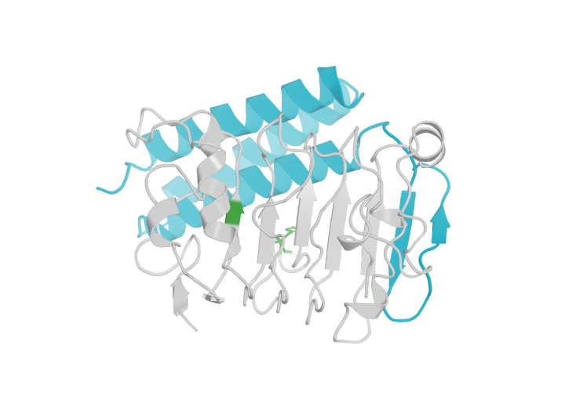</a> ipSAE **0.937** · Kd **1.34 nM** pKa 4.54 / 6.99 [PNG](DD1_Human_EGFR_APNovo_0960/Human.png) · [PSE](DD1_Human_EGFR_APNovo_0960/Human.pse) | <a href="DD1_Human_EGFR_APNovo_0960/Mouse.png">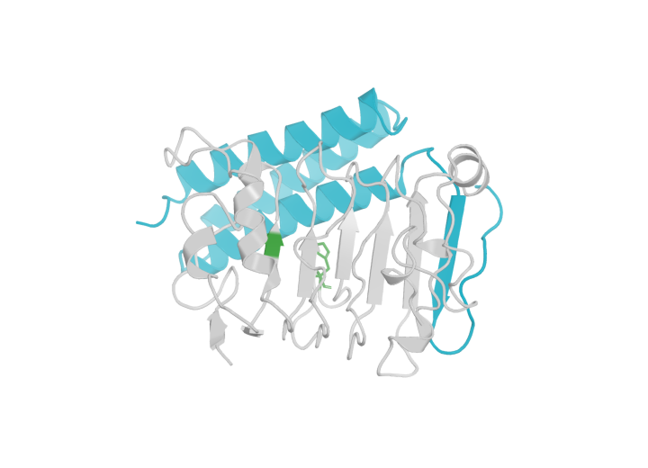</a> ipSAE **0.928** · Kd **0.84 nM** pKa 3.83 / 5.46 [PNG](DD1_Human_EGFR_APNovo_0960/Mouse.png) · [PSE](DD1_Human_EGFR_APNovo_0960/Mouse.pse) |
| 18 | [LigandAI 973](Ligand_AI_b6a74871_Design_973/) | <a href="Ligand_AI_b6a74871_Design_973/Human.png">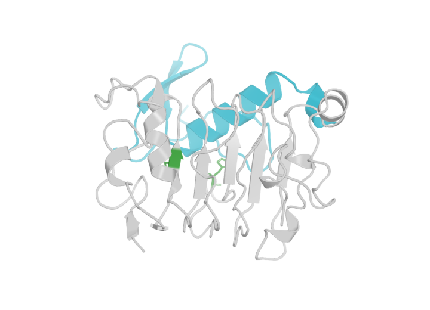</a> ipSAE **0.925** · Kd **267.89 nM** pKa 3.85 / 4.90 [PNG](Ligand_AI_b6a74871_Design_973/Human.png) · [PSE](Ligand_AI_b6a74871_Design_973/Human.pse) | <a href="Ligand_AI_b6a74871_Design_973/Mouse.png">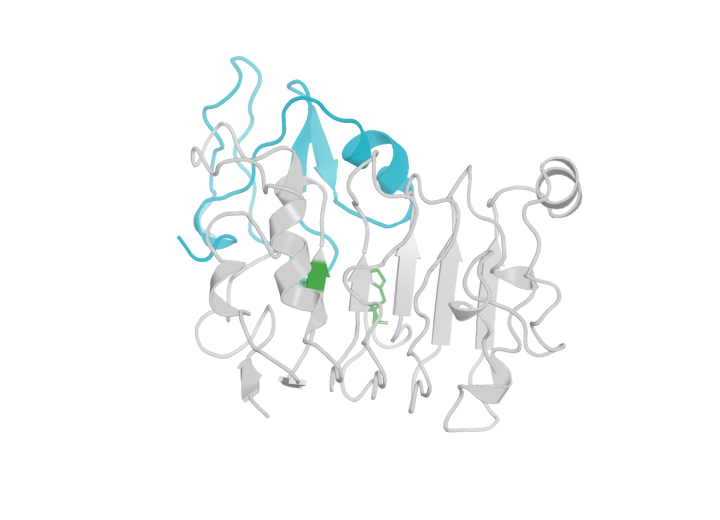</a> ipSAE **0.560** · Kd **142.01 nM** pKa 6.39 / 5.40 [PNG](Ligand_AI_b6a74871_Design_973/Mouse.png) · [PSE](Ligand_AI_b6a74871_Design_973/Mouse.pse) |
| 19 | [DD1_062 / 0514](DD1_062_phswitch_0514/) | <a href="DD1_062_phswitch_0514/Human.png">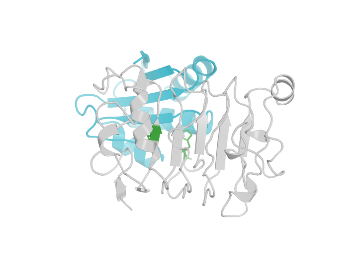</a> ipSAE **0.900** · Kd **90.96 nM** pKa 4.38 / 6.78 [PNG](DD1_062_phswitch_0514/Human.png) · [PSE](DD1_062_phswitch_0514/Human.pse) | <a href="DD1_062_phswitch_0514/Mouse.png">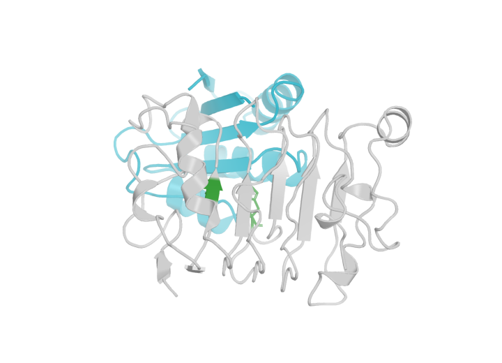</a> ipSAE **0.818** · Kd **151.62 nM** pKa 3.98 / 5.00 [PNG](DD1_062_phswitch_0514/Mouse.png) · [PSE](DD1_062_phswitch_0514/Mouse.pse) |
| 20 | [DD1_310 / 0412](DD1_310_phswitch_0412/) | <a href="DD1_310_phswitch_0412/Human.png">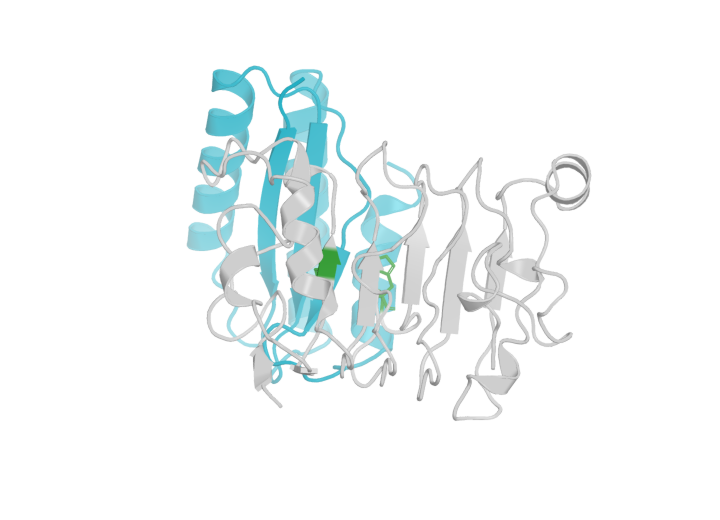</a> ipSAE **0.799** · Kd **45.99 nM** pKa 5.47 / 5.68 [PNG](DD1_310_phswitch_0412/Human.png) · [PSE](DD1_310_phswitch_0412/Human.pse) | <a href="DD1_310_phswitch_0412/Mouse.png">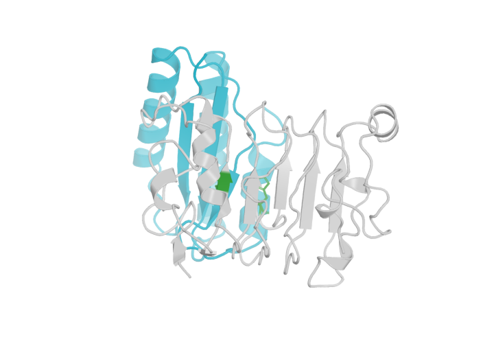</a> ipSAE **0.792** · Kd **43.82 nM** pKa 6.46 / 5.85 [PNG](DD1_310_phswitch_0412/Mouse.png) · [PSE](DD1_310_phswitch_0412/Mouse.pse) |
